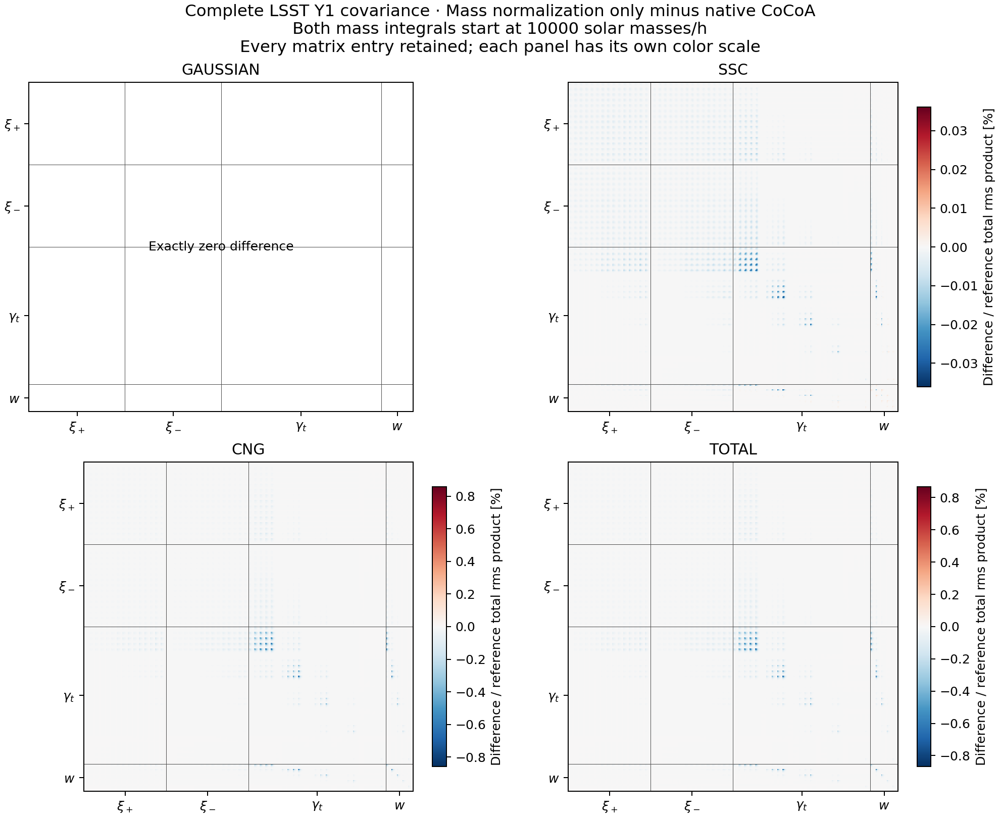
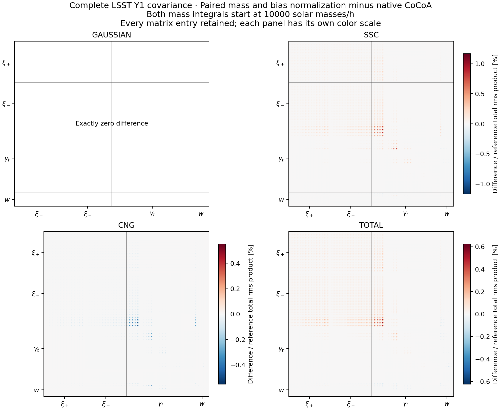

# Historical normalization sensitivity studies

These experiments change the native halo prescription. They are retained
as a study record, not as the current CoCoA--OneCovariance comparison.
The proposed unresolved-population model is not implemented.

#### Testing simultaneous mass and bias normalization

Define $`S(z)=\int f_{\rm CoCoA}(\nu,z)\,d\nu`$. Two explicit
diagnostic prescriptions keep the profiles, power spectra, halo mass
definition and integration limits fixed:

- **Mass normalization only:** use $`f'=f/S`$ and retain the fitted bias.
  The mass integral becomes one, but the full-fit bias integral becomes
  $`1/S`$. The existing additive I11 completion is recomputed. It now also
  compensates a mismatch in the full fit; it is no longer solely a
  correction for a finite mass range.
- **Mass normalization with a paired bias adjustment:** use
  $`f'=f/S`$ and $`b'=S\,b`$. Both full-fit integrals become one, to
  the numerical accuracy of CoCoA's original bias normalization. The
  product $`f'b'=fb`$ is unchanged at every peak height.

At redshift one, the first change lowers all abundances by **4.609%**.
The paired prescription additionally raises every halo bias by **4.832%**.
In that prescription, I11, I12 and I13 stay unchanged, including the I11
completion. The unbiased I02 and I04 decrease by the abundance factor.
Thus the one-halo trispectrum changes even though the higher-halo terms
do not. SSC can also change: CoCoA transfers a fractional halo response
to the supplied nonlinear power, and the denominator contains I02.

These transformations are tested through an explicit supplied-moment
adapter. **They are not installed in CoCoA or OneCovariance.** This is a
CoCoA modeling-sensitivity test, separate from the native cross-code results.

The complete LSST Y1 real-space calculation retains **all 1,560 entries**
of the data-vector ordering and every covariance element. The supplied CAMB
tables, Gaussian non-Limber setting, survey inputs and numerical settings
are identical in the three runs. No scale cuts are applied to this comparison.
The lower halo mass is 10,000 solar masses/h.

The table reports the largest absolute component change divided by the
native **total** rms product, $`\sqrt{C_{ii}^{\rm total}C_{jj}^{\rm total}}`$.
The common denominator allows the G, SSC and cNG columns to be compared.
The final column instead examines every generalized variance mode of the
total matrix, including combinations that an entry-by-entry plot can miss.

| Diagnostic change | G | SSC | cNG | Total | Largest total variance-mode change |
| --- | ---: | ---: | ---: | ---: | ---: |
| Mass normalization only | Exactly zero | 0.0361% | 0.8582% | 0.8678% | 2.2867% |
| Mass normalization and paired bias | Exactly zero | 1.1670% | 0.5519% | 0.6246% | 1.6263% |

**All three total matrices are positive definite.** The generalized
variance ratios span 0.97713–1.00007 for mass normalization alone and
0.98374–1.01608 for the paired prescription. Gaussian matrices are
bitwise identical. Relative to each component's own diagonal, the largest
changes are 1.67% in SSC and 4.74% in cNG for mass normalization alone;
for the paired prescription they are 12.60% and 3.40%, respectively.
The latter SSC change is smaller when measured against the total covariance,
as the table shows.





The [mass-only comparison](../../../../results/normalization_mass_only_20261006.json),
[paired comparison](../../../../results/normalization_mass_and_bias_20261006.json) and
[halo normalization measurements](../../../../results/normalization_ingredients_20261006.json)
record the inputs and diagnostics. Each full construction took about
51 seconds on the M2 Pro with eight threads:

| Prescription | Complete construction (s) |
| --- | ---: |
| Native CoCoA | 51.07 |
| Mass normalization only | 50.90 |
| Mass normalization and paired bias | 51.04 |

The alternative timings include the diagnostic adapter. These single runs
measure sensitivity at one cosmology and the
project's default numerical settings; they do not establish Fisher
convergence or which halo prescription better describes simulations.

To reproduce after activating the **Cocoa terminal** environment described
above, run from this repository. Every command uses a new output folder.

**Step :one:**: check the full-fit and finite-mass normalization integrals.

```bash
python scripts/run_normalization_covariance.py ingredients \
  --output work/normalization_ingredients
```

**Step :two:**: compute the unchanged covariance.

```bash
python scripts/run_normalization_covariance.py native \
  --output work/normalization_native
```

**Step :three:**: compute the mass-normalized alternative.

```bash
python scripts/run_normalization_covariance.py mass_only \
  --output work/normalization_mass_only
```

**Step :four:**: compute the alternative enforcing both constraints.

```bash
python scripts/run_normalization_covariance.py mass_and_bias \
  --output work/normalization_mass_and_bias
```

**Step :five:**: compare every component and draw the mass-only differences.

```bash
python scripts/compare_full_covariance.py \
  work/normalization_mass_only work/normalization_native \
  --output work/normalization_mass_only_comparison.json \
  --figure work/normalization_mass_only_difference.png \
  --label 'Mass normalization only minus native CoCoA'
```

**Step :six:**: compare and draw the paired-prescription differences.

```bash
python scripts/compare_full_covariance.py \
  work/normalization_mass_and_bias work/normalization_native \
  --output work/normalization_mass_and_bias_comparison.json \
  --figure work/normalization_mass_and_bias_difference.png \
  --label 'Paired mass and bias normalization minus native CoCoA'
```

#### An alternative that preserves the resolved halo fits

For a finite mass interval, denote its mass fraction by F and its
bias-weighted fraction by B. An unresolved component can supply mass
$`1-F`$ and have effective bias

$$
b_{\rm unresolved}=\frac{1-B}{1-F}.
$$

Then $`F+(1-F)=1`$ and $`B+(1-F)b_{\rm unresolved}=1`$.
At the current lower cutoff of 10,000 solar masses/h, the measurements are:

| Redshift | Resolved mass F | Resolved response B | Required unresolved bias |
| ---: | ---: | ---: | ---: |
| 0.1 | 0.71190 | 0.81145 | 0.65445 |
| 0.5 | 0.66521 | 0.76894 | 0.69015 |
| 1.0 | 0.60535 | 0.71615 | 0.71923 |

This accounts for both missing quantities without rescaling the retained
halos. Its response weight is exactly the existing I11 completion, 1−B.
It is an interpretation at the level of the two integral constraints:
CoCoA does not yet represent this as a separately calibrated population
with its own complete set of halo moments. It also replaces the unobserved
low-mass extrapolation rather than making the original analytic f integrate
to one over all peak heights.

**Which approach is preferable?** A joint, simulation-calibrated choice of
mass function and bias is the strongest basis for a strict halo model.
For retaining CoCoA's calibrated resolved-halo choices, explicitly modeling
the unresolved mass and response is a more conservative direction than
rescaling every halo. The paired rescaling above is a useful controlled
sensitivity test, not evidence that the altered bias fit is more accurate.

The [normalization record](../../../../results/bias_normalization_20261006.json)
includes the doubled-grid check. To reproduce it:

**Step :one:**: in the **OneCov terminal**, evaluate its native fits.

```bash
python scripts/diagnose_bias.py onecov --config work/shear_ssc/onecov.ini \
  --nodes 8193 --output work/bias_onecov_fine
```

**Step :two:**: in the **Cocoa terminal**, evaluate CoCoA's native fits.

```bash
python scripts/diagnose_bias.py cocoa --nodes 8193 \
  --output work/bias_cocoa_fine
```

