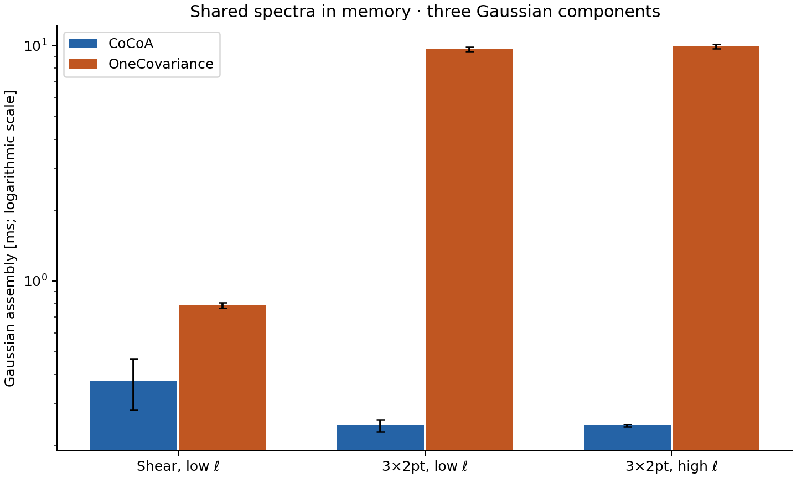

# CoCoA vs OneCovariance: covariance comparison

This repository will compare covariance calculations from
[CoCoA/CosmoLike](https://github.com/CosmoLike/cocoa) and
[OneCovariance](https://github.com/rreischke/OneCovariance).
It follows the reproducible-study format of
[CCL-benchmark](https://github.com/vivianmiranda/CCL-benchmark): matched
inputs, component comparisons, convergence checks, figures and timing logs.

The aim is to understand where the codes agree, explain differences in
their physical models and numerical methods, and measure execution time
at settings whose numerical accuracy has been checked.

This is an **accuracy comparison first**. We are not optimizing or
rewriting OneCovariance. Timing comparisons follow once the physical
choices and numerical accuracy of both calculations are understood.

**First comparison completed:** Gaussian covariance assembly agrees for
shared LSST Y1 angular spectra, matched noise and matched band weights.
Three small tests cover one source bin alone and two lens bins with that
source, including all crossed spectra. Both codes give positive definite
total matrices in every case.

| Shared-spectrum test | Matrix | Integer multipoles | Largest variance-mode difference |
| --- | --- | --- | ---: |
| Shear, source bin 3 | 5×5 | 30–149 | 0.000017% |
| 3×2pt, lens bins 1 and 2, source bin 3 | 30×30 | 30–149 | 0.000465% |
| Same 3×2pt subset | 30×30 | 1500–1619 | 0.000046% |

The differences are consistent with **OneCov's text-output rounding**:
an independent NumPy calculation reproduces every saved total entry at
seven significant digits and every split component at five significant
digits. Cocoa agrees with NumPy to floating-point precision. The mode
comparison considers every linear combination of the selected bandpowers,
not just diagonal variances: it reports the largest $`|\lambda-1|`$ for
$`C_{\mathrm{OneCov}}v=\lambda C_{\mathrm{Cocoa}}v`$, expressed as a percentage.

See the [comparison record](results/gaussian_assembly_20261005.json) and
[reproduction steps](#matched-gaussian). This establishes the Gaussian
contractions, noise normalization and binning for **shared spectra**.
It does not establish agreement of native spectra, SSC, cNG or real-space
covariances. The [earlier functional pilots](results/functional_pilots_20261005.json)
confirmed that the small native G, G+SSC and G+cNG paths run; their physical
and numerical comparison remains ahead. The timing comparison below covers
Gaussian components and band averaging only.

## Contents

1. [Scope](#scope)
2. [Comparison stages](#stages)
3. [Accuracy and execution time](#validation)
4. [Installation and compilation](#installation)
5. [Reproducing the comparison](#reproduction)
6. [Matched Gaussian assembly](#matched-gaussian)

## Scope <a name="scope"></a>

**LSST Y1 is the benchmark.** We start with small parts of its cosmic-shear,
galaxy–galaxy-lensing and clustering covariances. Full survey matrices are
a later goal, subject to measured runtime and memory requirements.
Fourier-space comparisons precede real-space ones. Other surveys can be
added after this comparison is understood.

The covariance contributions will be kept separate:

| Contribution | Physical origin |
| --- | --- |
| Gaussian (G) | Products of two-point correlations, including shot and shape noise. |
| Super-sample (SSC) | Modes larger than the survey change the fluctuations measured inside it. |
| Connected non-Gaussian (cNG) | Connected four-point correlations beyond the Gaussian contribution. |

The first comparisons will use massless neutrinos, Limber spectra, zero
intrinsic alignment and a simple survey footprint. Galaxy samples will
use matched linear bias rather than OneCovariance's HOD model. Non-Limber
and intrinsic-alignment comparisons will follow separately where the
implemented models can be matched.

The DES cluster 6×2pt + counts calculation is outside the initial scope.
OneCovariance's photometric/spectroscopic 6×2pt example describes a
different set of observables.

## Comparison stages <a name="stages"></a>

1. **Gaussian covariance from shared angular spectra.** Supply identical
   spectra, noise levels and bin definitions. Start with one source bin
   and a few multipole bands to isolate covariance assembly from spectrum
   generation and establish the first runtime measurement.
2. **Matter trispectrum and SSC ingredients.** Compare the 1h, 2h, 3h
   and 4h contributions, including both two-halo partitions, and the
   matter-power response entering SSC. Begin at one redshift with a few
   wavenumbers, including unequal wavenumber pairs. Match halo definitions,
   mass functions, concentration relations and integration ranges first.
3. **Selected survey blocks.** Compute SSC and cNG separately for a small
   shear block, then add representative galaxy and cross-bin blocks.
   Compare their sum with G using the same cosmology, redshift
   distributions, galaxy biases, densities, shape noise and binning.
4. **Diagnose remaining differences.** Vary one choice at a time and
   inspect intermediate quantities. In particular, distinguish Cocoa's
   full-sky real-space transforms from OneCovariance's flat-sky transforms.
5. **Expand only after the pilots.** Add redshifts, wavenumbers and output
   blocks in small increments. Use their measured costs to decide which
   comparisons fit the laptop and which full matrices belong on a server.

Shared-input tests will isolate individual calculations. Separate runs
with each code generating its own ingredients will test the full pipeline.
Diagnostic adaptations will be documented separately from comparisons
using the released implementations.

## Gaussian results and execution time <a name="validation"></a>

The correlation matrices agree at both multipole ranges. The right panels
magnify the saved-matrix differences by a million; their small residuals
come from OneCov's seven-significant-digit text output.


The variance components also agree. Sample variance dominates the low-ell
galaxy spectra; shape noise dominates the high-ell shear variance for these
LSST Y1 densities. Lines show Cocoa and open circles show OneCov. Each
group contains five bands, with multipole increasing from left to right.


Vector figures: [matrices](results/figures/gaussian_matrices.pdf),
[components](results/figures/gaussian_components.pdf).

### Gaussian timing differences

**Apple M2 Pro, macOS 13.7.5, eight OpenMP threads.** Both codes receive
the same spectra already in memory and compute all three Gaussian parts.
Cocoa uses its production `_interface`; OneCov uses its unmodified
`covELL_gaussian` method.

| Gaussian case | CoCoA (ms) | OneCov (ms) | OneCov / CoCoA |
| --- | ---: | ---: | ---: |
| Shear, 30 ≤ ℓ < 150 | 0.374 ± 0.091 | 0.786 ± 0.021 | 2.1 |
| 3×2pt, 30 ≤ ℓ < 150 | 0.242 ± 0.014 | 9.647 ± 0.193 | 39.8 |
| 3×2pt, 1500 ≤ ℓ < 1620 | 0.243 ± 0.003 | 9.894 ± 0.202 | 40.7 |

These are repeated-batch means; ± shows the scatter between batches.
The tiny shear case is more variable: Cocoa's two run means were 0.327 and
0.422 ms. The [timing record](results/gaussian_timing_20261005.json) retains
all samples, first-call times, setup times and numerical checks.

The timer includes numerical output allocation, but excludes spectrum
generation, initialization and file writing. OneCov's final rearrangement
of its blocks into one matrix is also outside the timer. These are
**small Gaussian component timings, not full-survey covariance runtimes**.
The in-memory components of both codes agree with NumPy within 10⁻¹⁵ in
variance-scaled residuals.



[Vector timing figure](results/figures/gaussian_timing.pdf).

## Installation and compilation <a name="installation"></a>

We use Cocoa's Python 3.11 Conda base and a private `.local` environment
inside this repository. Follow the
[Cocoa Conda installation recipe](https://github.com/CosmoLike/cocoa#required_packages_conda)
if that base is not installed. Cocoa and OneCovariance are separate sibling
checkouts; Cocoa must already have CAMB compiled.

Open a fresh Bash terminal in `OneCov-benchmark-/`. Keep the Cocoa export
session in a separate terminal.

**Step :one:**: activate the Conda base.

```bash
conda activate cocoa
```

**Step :two:**: inspect [set_installation_options.sh](set_installation_options.sh).
It specifies the code paths, studied revisions and Python package versions.

**Step :three:**: prepare the private environment and download dependencies.

```bash
source setup_onecov.sh
```

**Step :four:**: compile the native extensions from local sources.

```bash
source compile_onecov.sh
```

**Step :five:**: activate the comparison environment.

```bash
source start_onecov.sh
```

| File | Purpose |
| --- | --- |
| [set_installation_options.sh](set_installation_options.sh) | Select code paths and pinned package versions. |
| [setup_onecov.sh](setup_onecov.sh) | Create `.local`, install Python dependencies and download healpy sources. |
| [compile_onecov.sh](compile_onecov.sh) | Build healpy and OneCovariance's bundled Levin extension offline; check imports. |
| [start_onecov.sh](start_onecov.sh) | Activate the private environment. |
| [stop_onecov.sh](stop_onecov.sh) | Restore the shell's previous Python environment. |

The scripts reuse the existing OneCovariance checkout and Cocoa's CAMB.
They do not modify either numerical code or install packages into Cocoa.
The [environment notes](docs/environment.md) describe the shared libraries
and the initial pilot environment.

### Starting and stopping later sessions

After installation, open a fresh Bash terminal in `OneCov-benchmark-/`.
Setup and compilation do not need to be repeated for each calculation.

**Step :one:**: activate the Conda base.

```bash
conda activate cocoa
```

**Step :two:**: activate the comparison's private `.local` environment.

```bash
source start_onecov.sh
```

**Step :three:**: after the calculation, leave the private environment.

```bash
source stop_onecov.sh
```

## Reproducing the comparison <a name="reproduction"></a>

### What the pilot represents

The exporter reads Cocoa's `projects/lsst_y1/covariance` configuration.
The default subset is source bin 3 and lens bins 1 and 2, retaining their
original LSST Y1 identities and densities.

| Input | LSST Y1 forecast choice |
| --- | --- |
| Area | 12,300 deg² |
| Source density | 2 arcmin⁻² in the selected source bin |
| Lens density | 3.6 arcmin⁻² in each selected lens bin |
| Shape dispersion | 0.26 per component |
| Lens biases | 1.72716 and 1.65168 for lens bins 1 and 2 |
| Cosmology | Ωm = 0.3, Ωb = 0.05, h = 0.7, ns = 0.965, As = 2.1×10⁻⁹ |
| First output | Five Fourier bands between ℓ = 30 and 3,000 |

Selecting one source bin does **not** put all five bins' galaxies into it.
The scripts preserve its density and export its actual n(z) column. These
are the project's forecast choices, not its supplied likelihood covariance.

### Exporting the Cocoa inputs

Follow the [main Cocoa setup](https://github.com/CosmoLike/cocoa#cobaya_base_code_examples)
and [LSST Y1 covariance instructions](https://github.com/CosmoLike/cocoa_lsst_y1#computing_covariances).
We assume Cocoa and LSST Y1 are installed, the shell is Bash, and
`cocoa/`, `OneCovariance/` and `OneCov-benchmark-/` are sibling directories.

Open a second, fresh Bash terminal in `OneCov-benchmark-/`.

**Step :one:**: activate the Conda base.

```bash
conda activate cocoa
```

**Step :two:**: enter Cocoa's runtime directory.

```bash
cd ../cocoa/Cocoa
```

**Step :three:**: activate Cocoa's private environment.

```bash
source start_cocoa.sh
```

**Step :four:**: enable the LSST Y1 project and covariance bindings.

```bash
unset IGNORE_COSMOLIKE_LSST_Y1_CODE IGNORE_COSMOLIKE_LSST_Y1_COVARIANCE
```

**Step :five:**: compile the project interface.

```bash
source ./projects/lsst_y1/scripts/compile_lsst_y1.sh
```

**Step :six:**: select eight OpenMP threads using your platform's settings.

- Linux

  ```bash
  export OMP_NUM_THREADS=8 OMP_PROC_BIND=close \
    OMP_PLACES=cores OMP_DYNAMIC=FALSE \
    OPENBLAS_NUM_THREADS=1 MKL_NUM_THREADS=1
  ```

- macOS (arm)

  ```bash
  export OMP_NUM_THREADS=8 OMP_PROC_BIND=disabled \
    OMP_PLACES=cores OMP_DYNAMIC=FALSE \
    OPENBLAS_NUM_THREADS=1 MKL_NUM_THREADS=1
  ```

**Step :seven:**: return to the benchmark directory.

```bash
cd ../../OneCov-benchmark-
```

**Step :eight:**: export the LSST Y1 inputs.

```bash
python scripts/prepare_lsst_y1.py \
  --cocoa ../cocoa/Cocoa --output work/lsst_y1
```

This writes the selected distributions, constant bias tables, shared
noise-free angular spectra, CAMB nonlinear power and a manifest containing
revisions and input hashes. It computes sigma8 from the specified As for
OneCovariance's amplitude input. It does not compute a covariance matrix.

Use `--source-bin 4 --lens-bins 2 3` to select other original LSST bins.
The two lens bins must be distinct. At the studied OneCov revision, its
supplied-bias path fails for a single lens bin because the reader and
constructor disagree about the array shape. Two real lens bins avoid that
problem without modifying OneCovariance.

### Running the small Gaussian case

We assume installation is complete and the inputs are in `work/lsst_y1`.
Open a fresh Bash terminal in `OneCov-benchmark-/`. Run one numerical job
at a time.

**Step :one:**: activate the Conda base.

```bash
conda activate cocoa
```

**Step :two:**: activate the comparison's private environment.

```bash
source start_onecov.sh
```

**Step :three:**: select eight OpenMP threads using your platform's settings.

- Linux

  ```bash
  export OMP_NUM_THREADS=8 OMP_PROC_BIND=close \
    OMP_PLACES=cores OMP_DYNAMIC=FALSE \
    OPENBLAS_NUM_THREADS=1 MKL_NUM_THREADS=1
  ```

- macOS (arm)

  ```bash
  export OMP_NUM_THREADS=8 OMP_PROC_BIND=disabled \
    OMP_PLACES=cores OMP_DYNAMIC=FALSE \
    OPENBLAS_NUM_THREADS=1 MKL_NUM_THREADS=1
  ```

**Step :four:**: compute the five-band shear Gaussian covariance.

```bash
python scripts/run_onecov.py \
  --onecov ../OneCovariance --inputs work/lsst_y1 \
  --output work/shear_gaussian --timeout 180
```

**Step :five:**: check the saved shear covariance.

```bash
python scripts/check_result.py work/shear_gaussian
```

The default uses shared Cocoa angular spectra and produces a **5×5 shear
Gaussian covariance**. `check_result.py` verifies finite entries, symmetry,
positive definiteness and the Gaussian normalization against an independent
integer-multipole sum.

**Step :six:**: include galaxy clustering, galaxy–shear and their cross blocks.

```bash
python scripts/run_onecov.py \
  --inputs work/lsst_y1 --case 3x2 \
  --output work/small_3x2_gaussian --timeout 180
```

**Step :seven:**: check the saved 3×2pt covariance.

```bash
python scripts/check_result.py work/small_3x2_gaussian
```

This gives a **30×30 matrix**, including the cross spectrum between the two
lens bins. The analytic Gaussian checker currently covers shear; the 3x2
check covers matrix finiteness, symmetry and positivity.

> [!NOTE]
> OneCovariance averages integer multipoles uniformly in these Gaussian
> bands. Cocoa's Fourier operator uses mode-count weights. Identical band
> edges alone therefore do not define identical estimators. The comparison
> below supplies uniform weights to Cocoa's existing production Gaussian
> kernel. This benchmark adapter does not change Cocoa's default estimator.

### Comparing matched Gaussian assembly <a name="matched-gaussian"></a>

Use the two terminals prepared above: one with Cocoa active, the other
with `start_onecov.sh` active. Both should be in `OneCov-benchmark-/`, with
the platform's eight-thread settings. Run the following steps sequentially.

These tests use five bands in a narrow multipole interval. Exporting each
integer multipole removes interpolation from the comparison. This matters:
on a coarse grid, interpolating a product of spectra is different from
interpolating each spectrum and then multiplying.

**Step :one:**: in the **Cocoa terminal**, export the low-multipole inputs.

```bash
python scripts/prepare_lsst_y1.py \
  --cocoa ../cocoa/Cocoa --output work/lsst_y1_integer_30_150 \
  --integer-ell-range 30 150
```

The export includes both endpoints. The covariance sums include the lower
band edge and exclude the upper edge, so these bands use multipoles 30–149.

**Step :two:**: in the **OneCov terminal**, compute the shear covariance.

```bash
python scripts/run_onecov.py \
  --inputs work/lsst_y1_integer_30_150 --case shear \
  --band-limits 30 150 --output work/assembly_shear_30_150
```

**Step :three:**: in the **OneCov terminal**, compute all small 3×2pt blocks.

```bash
python scripts/run_onecov.py \
  --inputs work/lsst_y1_integer_30_150 --case 3x2 \
  --band-limits 30 150 --output work/assembly_3x2_30_150
```

**Step :four:**: in the **Cocoa terminal**, compare the shear calculation.

```bash
python scripts/compare_gaussian.py work/assembly_shear_30_150 \
  --cocoa ../cocoa/Cocoa --output work/reviewed_gaussian/shear_30_150
```

**Step :five:**: in the **Cocoa terminal**, compare the 3×2pt calculation.

```bash
python scripts/compare_gaussian.py work/assembly_3x2_30_150 \
  --cocoa ../cocoa/Cocoa --output work/reviewed_gaussian/3x2_30_150
```

**Step :six:**: in the **Cocoa terminal**, export the higher-multipole inputs.

```bash
python scripts/prepare_lsst_y1.py \
  --cocoa ../cocoa/Cocoa --output work/lsst_y1_integer_1500_1620 \
  --integer-ell-range 1500 1620
```

**Step :seven:**: in the **OneCov terminal**, compute this 3×2pt covariance.

```bash
python scripts/run_onecov.py \
  --inputs work/lsst_y1_integer_1500_1620 --case 3x2 \
  --band-limits 1500 1620 --output work/assembly_3x2_1500_1620
```

**Step :eight:**: in the **Cocoa terminal**, compare the higher multipoles.

```bash
python scripts/compare_gaussian.py work/assembly_3x2_1500_1620 \
  --cocoa ../cocoa/Cocoa --output work/reviewed_gaussian/3x2_1500_1620
```

`compare_gaussian.py` calls Cocoa's production `_interface` with the shared
spectra, diagonal shot/shape noise and uniform band weights. It also
computes the two Gaussian Wick contractions independently with NumPy.
No numerical source in either code is modified.

Each comparison saves `comparison.json` and `matrices.npz`. These retain
sample variance, mixed signal/noise, pure noise and their total separately.
The script checks positive total matrices and generalized variance ratios
between the codes. It fails if agreement exceeds the native text precision.

For the 3×2pt tests, matrix order is $`g_1g_1`$, $`g_1g_2`$, $`g_2g_2`$,
$`g_1\gamma`$, $`g_2\gamma`$, $`\gamma\gamma`$, with five bands per spectrum.
Including $`g_1g_2`$ checks cross-bin contractions even though this spectrum
need not belong to the likelihood's data vector.

The next comparison is the generation of the angular spectra themselves,
first using shared CAMB power and then native power. Those calculations
need their own convergence checks before interpreting relative differences.

### Reproducing Gaussian plots and timings

Use the prepared Cocoa and OneCov terminals from the preceding section.
The commands below time the low-ell 3×2pt case. To time the other cases,
replace `3x2_30_150` with `shear_30_150` or `3x2_1500_1620` in both paths.

**Step :one:**: in the **OneCov terminal**, time its Gaussian components.

```bash
python scripts/time_gaussian.py work/reviewed_gaussian/3x2_30_150 \
  --backend onecov --output work/gaussian_timing/onecov_3x2_30_150
```

**Step :two:**: after it finishes, in the **Cocoa terminal**, time Cocoa.

```bash
python scripts/time_gaussian.py work/reviewed_gaussian/3x2_30_150 \
  --backend cocoa --output work/gaussian_timing/cocoa_3x2_30_150
```

Each run saves `timing.json`, including 31 batches and a separately
measured first call. Cocoa batches contain 100 calls; OneCov batches
contain 10. Both recompute outputs on every call. Repeats require a new
output directory, preserving earlier measurements.

**Step :three:**: in either terminal, regenerate the figures from the
validated matrices and the saved timing record.

```bash
python scripts/plot_gaussian.py --comparisons work/reviewed_gaussian \
  --timings results/gaussian_timing_20261005.json --output results/figures
```

This writes PNG and PDF versions. Omitting `--timings` regenerates only
the matrix and component figures.

### Adding SSC and connected non-Gaussian contributions

We assume installation is complete and the inputs are in `work/lsst_y1`.
Open a fresh Bash terminal in `OneCov-benchmark-/`. Run the two calculations
sequentially.

**Step :one:**: activate the Conda base.

```bash
conda activate cocoa
```

**Step :two:**: activate the comparison's private environment.

```bash
source start_onecov.sh
```

**Step :three:**: select eight OpenMP threads using your platform's settings.

- Linux

  ```bash
  export OMP_NUM_THREADS=8 OMP_PROC_BIND=close \
    OMP_PLACES=cores OMP_DYNAMIC=FALSE \
    OPENBLAS_NUM_THREADS=1 MKL_NUM_THREADS=1
  ```

- macOS (arm)

  ```bash
  export OMP_NUM_THREADS=8 OMP_PROC_BIND=disabled \
    OMP_PLACES=cores OMP_DYNAMIC=FALSE \
    OPENBLAS_NUM_THREADS=1 MKL_NUM_THREADS=1
  ```

**Step :four:**: compute the shear Gaussian and SSC contributions.

```bash
python scripts/run_onecov.py \
  --inputs work/lsst_y1 --terms ssc --spectra native \
  --output work/shear_ssc --timeout 600
```

**Step :five:**: check the saved Gaussian plus SSC covariance.

```bash
python scripts/check_result.py work/shear_ssc
```

**Step :six:**: compute the shear Gaussian and connected contributions.

```bash
python scripts/run_onecov.py \
  --inputs work/lsst_y1 --terms connected --spectra native \
  --output work/shear_connected --timeout 600
```

**Step :seven:**: check the saved Gaussian plus connected covariance.

```bash
python scripts/check_result.py work/shear_connected
```

`--terms ssc` computes G+SSC; `--terms connected` computes G+cNG.
The native list and separate matrix files preserve the contributions.
The pilot's eight-point trispectrum table measures feasibility, **not
converged cNG accuracy**. Halo prescriptions and footprint normalization
still need to be matched before interpreting differences from Cocoa.

The three spectrum choices isolate different calculations:

| `--spectra` | What OneCovariance receives |
| --- | --- |
| `shared-cells` | Cocoa angular spectra; isolates Gaussian covariance assembly. |
| `shared-power` | Cocoa CAMB nonlinear P(k,z); OneCov performs the angular projection. |
| `native` | Cosmology and survey inputs; OneCov generates its own spectra. |

Supplied power does not replace every linear-power calculation inside the
halo response or trispectrum. Shared-input and native runs must retain
their separate labels.

### Inspecting and refining a run

Every run writes `onecov.ini`, `input_manifest.json`, `preflight.log`,
`native.log` and `run.json`. The latter records status, revisions, package
versions, worker count, wall time and peak child memory. A timeout stops
the child process group and keeps partial output. Retry in a new directory.

The recorded wall time covers the fresh native CLI, including imports,
setup, computation and writing. It is a feasibility measurement, not yet
the separated timing breakdown needed for a performance comparison.
Peak child memory is not a sum over simultaneous worker processes.

Copy [onecov_pilot.ini](configs/onecov_pilot.ini), change one numerical
control and pass it with `--template`. `--prepare-only` writes an INI without
importing or running OneCovariance. Refining the internal spectrum grid
does not refine a supplied C_ell table; regenerate that input separately.

Generated files live under ignored `work/`. Small reviewed validation
summaries belong in `results/`; full matrices and disposable runs do not.
The scripts contain no changes to either code's numerical implementation.
