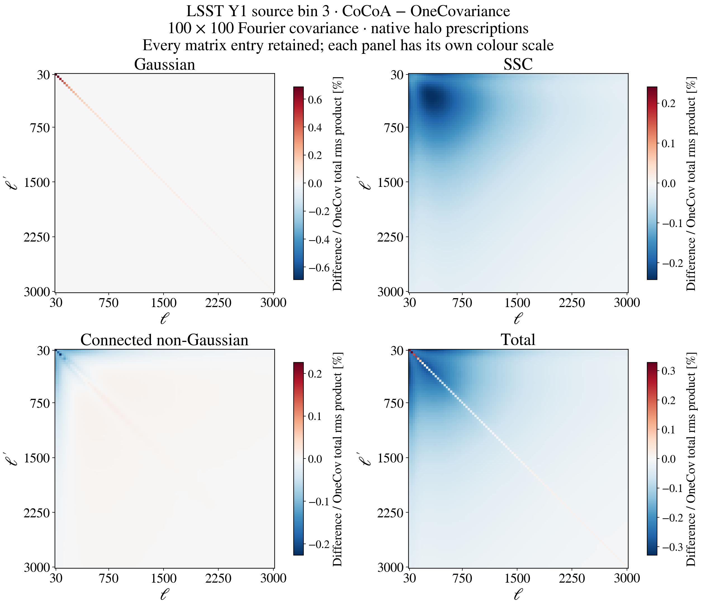
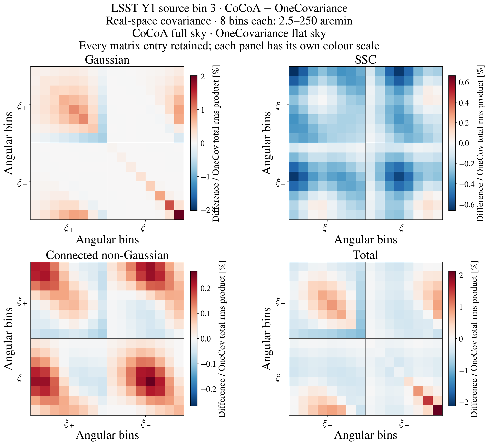
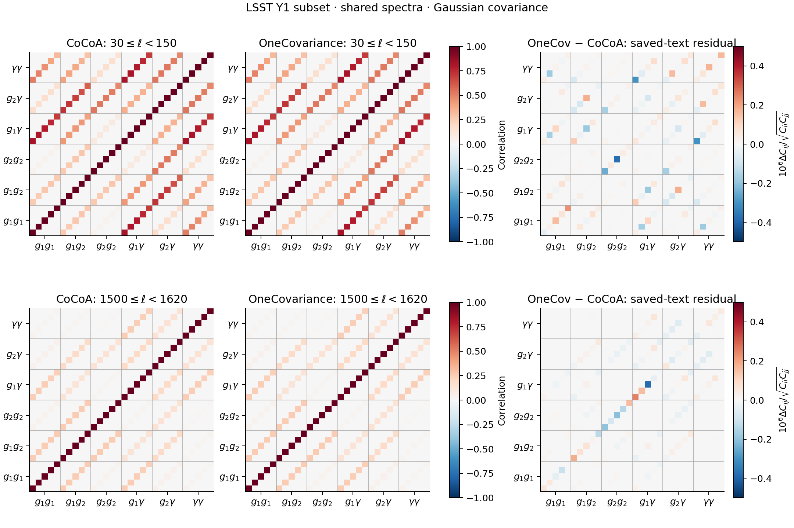
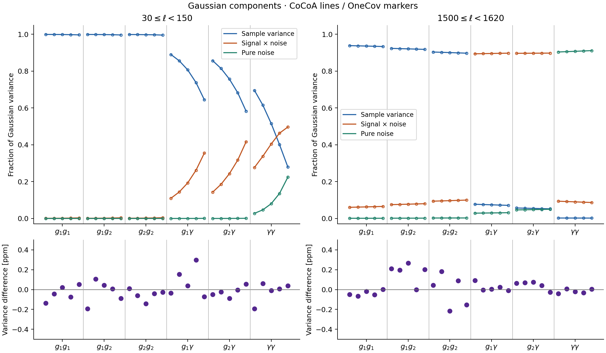
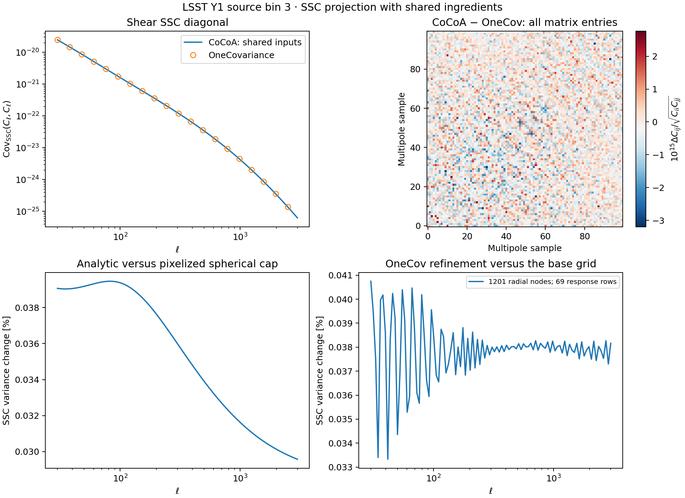
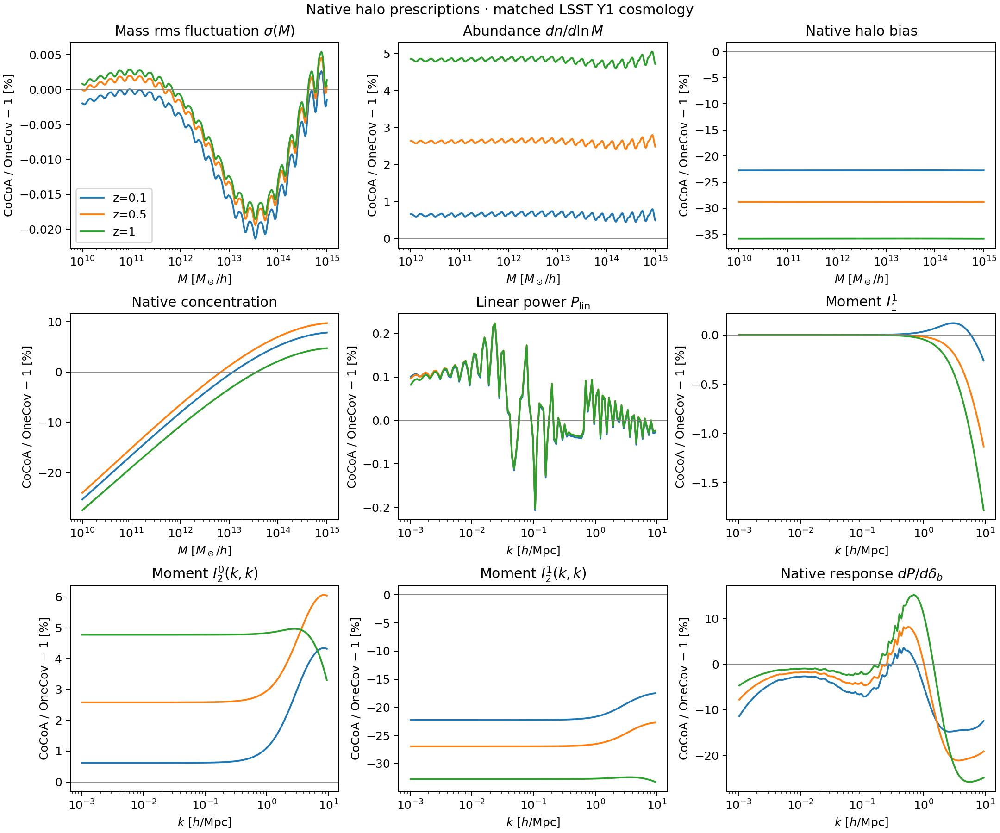
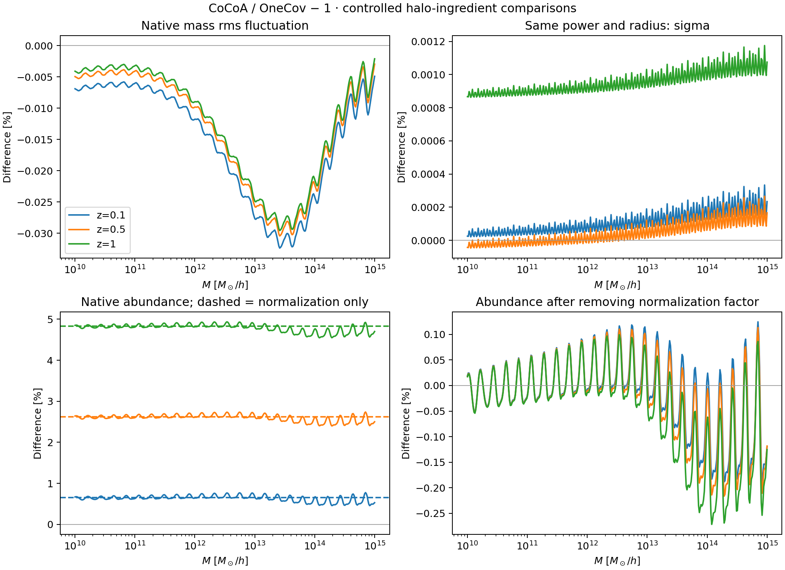
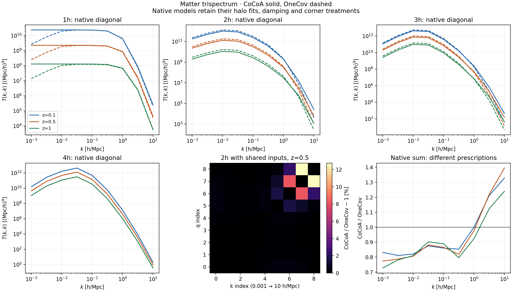
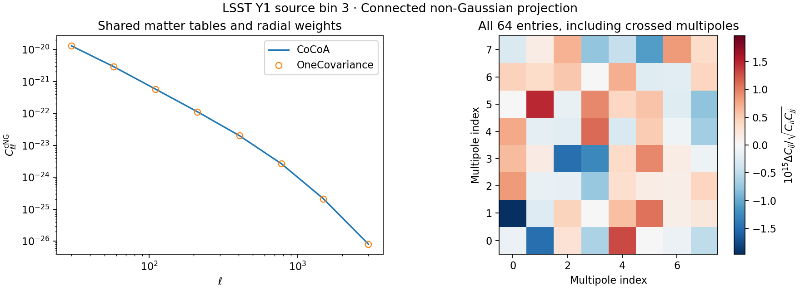

# CoCoA vs OneCovariance: covariance comparison

This repository compares covariance calculations from
[CoCoA/CosmoLike](https://github.com/CosmoLike/cocoa) and
[OneCovariance](https://github.com/rreischke/OneCovariance).
It follows the reproducible-study format of
[CCL-benchmark](https://github.com/vivianmiranda/CCL-benchmark): matched
inputs, component comparisons, convergence checks, figures and timing logs.

The aim is to understand where the codes agree, explain differences in
their physical models and numerical methods, and measure execution time
at settings whose numerical accuracy has been checked.

This is an **accuracy comparison first**. We are not optimizing or
rewriting OneCovariance. Timing comparisons follow once the physical
choices and numerical accuracy of both calculations are understood.

**First comparison completed:** Gaussian covariance assembly agrees for
shared LSST Y1 angular spectra, matched noise and matched band weights.
Three small tests cover one source bin alone and two lens bins with that
source, including all crossed spectra. Both codes give positive definite
total matrices in every case.

| Shared-spectrum test | Matrix | Integer multipoles | Largest variance-mode difference |
| --- | --- | --- | ---: |
| Shear, source bin 3 | 5×5 | 30–149 | 0.000017% |
| 3×2pt, lens bins 1 and 2, source bin 3 | 30×30 | 30–149 | 0.000465% |
| Same 3×2pt subset | 30×30 | 1500–1619 | 0.000046% |

The differences are consistent with **OneCov's text-output rounding**:
OneCov saves totals at seven significant digits and split components at
five significant digits. The mode comparison considers every linear
combination of the selected bandpowers, not just diagonal variances:
it reports the largest $`|\lambda-1|`$ for
$`C_{\mathrm{OneCov}}v=\lambda C_{\mathrm{Cocoa}}v`$, expressed as a percentage.

See the [comparison record](results/gaussian_assembly_20261005.json) and
[reproduction steps](#matched-gaussian). This establishes the Gaussian
contractions, noise normalization and binning for **shared spectra**.
It does not establish agreement of native spectra or halo ingredients.
The [SSC comparison](#ssc-comparison) and
[cNG projection comparison](#connected-comparison) separately test the
non-Gaussian contributions with shared inputs. The
[halo study](#halo-comparison) identifies native-model differences, and the
[trispectrum study](#trispectrum-comparison) isolates an off-diagonal
2-halo assembly discrepancy. Timing tables cover
[Gaussian components](#validation), [SSC and cNG projection, and native
halo moments](#non-gaussian-timings), with their different scopes stated.

**Complete shear comparison:** the four panels below show **CoCoA minus
OneCovariance** for the same 100 × 100 Fourier covariance of LSST Y1 source
bin 3. Both codes receive the same CAMB nonlinear power for their Gaussian
spectra and retain their own halo prescriptions for SSC and cNG. Every
matrix entry is included. This is a selected source-bin calculation;
the full LSST Y1 real-space comparison remains to be computed.



[Vector figure](results/figures/complete_shear_difference.pdf) ·
[Settings, results and reproduction](#complete-shear).

**Real-space comparison:** the corresponding 16 × 16 matrix contains
xi+ and xi− for the same source bin, including their cross-covariance.
Each code uses its own real-space numerical settings: CoCoA's LSST defaults
and OneCovariance's shipped real-space example.



[Vector figure](results/figures/real_shear_difference.pdf) ·
[Real-space results, timings and reproduction](#real-shear).

## Contents

1. [Scope](#scope)
2. [Comparison stages](#stages)
3. [Accuracy and execution time](#validation)
4. [Installation and compilation](#installation)
5. [Reproducing the comparison](#reproduction)
6. [Matched Gaussian assembly](#matched-gaussian)
7. [SSC comparison](#ssc-comparison)
8. [Halo-model ingredients](#halo-comparison)
9. [Mass rms fluctuation sigma(M)](#sigma-comparison)
10. [Halo-abundance differences](#abundance-comparison)
11. [Separated halo trispectra](#trispectrum-comparison)
12. [Connected non-Gaussian projection](#connected-comparison)
13. [SSC, halo and cNG timing differences](#non-gaussian-timings)
14. [Complete Fourier shear covariance](#complete-shear)
15. [Real-space shear covariance](#real-shear)

## Scope <a name="scope"></a>

**LSST Y1 is the benchmark.** We start with small parts of its cosmic-shear,
galaxy–galaxy-lensing and clustering covariances. Full survey matrices are
a later goal, subject to measured runtime and memory requirements.
Fourier-space comparisons precede real-space ones. Other surveys can be
added after this comparison is understood.

The covariance contributions will be kept separate:

| Contribution | Physical origin |
| --- | --- |
| Gaussian (G) | Products of two-point correlations, including shot and shape noise. |
| Super-sample (SSC) | Modes larger than the survey change the fluctuations measured inside it. |
| Connected non-Gaussian (cNG) | Connected four-point correlations beyond the Gaussian contribution. |

The first comparisons will use massless neutrinos, Limber spectra, zero
intrinsic alignment and a simple survey footprint. Galaxy samples will
use matched linear bias rather than OneCovariance's HOD model. Non-Limber
and intrinsic-alignment comparisons will follow separately where the
implemented models can be matched.

The DES cluster 6×2pt + counts calculation is outside the initial scope.
OneCovariance's photometric/spectroscopic 6×2pt example describes a
different set of observables.

## Comparison stages <a name="stages"></a>

1. **Gaussian covariance from shared angular spectra.** Supply identical
   spectra, noise levels and bin definitions. Start with one source bin
   and a few multipole bands to isolate covariance assembly from spectrum
   generation and establish the first runtime measurement.
2. **Matter trispectrum and SSC ingredients.** Compare the 1h, 2h, 3h
   and 4h contributions, including both two-halo partitions, and the
   matter-power response entering SSC. Begin at one redshift with a few
   wavenumbers, including unequal wavenumber pairs. Match halo definitions,
   mass functions, concentration relations and integration ranges first.
3. **Selected survey blocks.** Compute SSC and cNG separately for a small
   shear block, then add representative galaxy and cross-bin blocks.
   Compare their sum with G using the same cosmology, redshift
   distributions, galaxy biases, densities, shape noise and binning.
4. **Diagnose remaining differences.** Vary one choice at a time and
   inspect intermediate quantities. In particular, distinguish Cocoa's
   full-sky real-space transforms from OneCovariance's flat-sky transforms.
5. **Expand only after the pilots.** Add redshifts, wavenumbers and output
   blocks in small increments. Use their measured costs to decide which
   comparisons fit the laptop and which full matrices belong on a server.

Shared-input tests will isolate individual calculations. Separate runs
with each code generating its own ingredients will test the full pipeline.
Diagnostic adaptations will be documented separately from comparisons
using the released implementations.

## Gaussian results and execution time <a name="validation"></a>

The correlation matrices agree at both multipole ranges. The right panels
magnify the saved-matrix differences by a million; their small residuals
come from OneCov's seven-significant-digit text output.



The variance components also agree. Sample variance dominates the low-ell
galaxy spectra; shape noise dominates the high-ell shear variance for these
LSST Y1 densities. Lines show Cocoa and open circles show OneCov. Each
group contains five bands, with multipole increasing from left to right.



Vector figures: [matrices](results/figures/gaussian_matrices.pdf),
[components](results/figures/gaussian_components.pdf).

### Gaussian timing differences

**Apple M2 Pro, macOS 13.7.5, eight OpenMP threads.** Both codes receive
the same spectra already in memory and compute all three Gaussian parts.
Cocoa uses its production `_interface`; OneCov uses its unmodified
`covELL_gaussian` method.

| Gaussian case | CoCoA (ms) | OneCov (ms) | OneCov / CoCoA |
| --- | ---: | ---: | ---: |
| Shear, 30 ≤ ℓ < 150 | 0.374 ± 0.091 | 0.786 ± 0.021 | 2.1 |
| 3×2pt, 30 ≤ ℓ < 150 | 0.242 ± 0.014 | 9.647 ± 0.193 | 39.8 |
| 3×2pt, 1500 ≤ ℓ < 1620 | 0.243 ± 0.003 | 9.894 ± 0.202 | 40.7 |

These are repeated-batch means; ± shows the scatter between batches.
The tiny shear case is more variable: Cocoa's two run means were 0.327 and
0.422 ms. The [timing record](results/gaussian_timing_20261005.json) retains
all samples, first-call times, setup times and numerical checks.

The timer includes numerical output allocation, but excludes spectrum
generation, initialization and file writing. OneCov's final rearrangement
of its blocks into one matrix is also outside the timer. These are
**small Gaussian component timings, not full-survey covariance runtimes**.

## Installation and compilation <a name="installation"></a>

We use Cocoa's Python 3.11 Conda base and a private `.local` environment
inside this repository. Follow the
[Cocoa Conda installation recipe](https://github.com/CosmoLike/cocoa#required_packages_conda)
if that base is not installed. Cocoa and OneCovariance are separate sibling
checkouts; Cocoa must already have CAMB compiled.

Open a fresh Bash terminal in `OneCov-benchmark-/`. Keep the Cocoa export
session in a separate terminal.

**Step :one:**: activate the Conda base.

```bash
conda activate cocoa
```

**Step :two:**: inspect [set_installation_options.sh](set_installation_options.sh).
It specifies the code paths, studied revisions and Python package versions.

**Step :three:**: prepare the private environment and download dependencies.

```bash
source setup_onecov.sh
```

**Step :four:**: compile the native extensions from local sources.

```bash
source compile_onecov.sh
```

**Step :five:**: activate the comparison environment.

```bash
source start_onecov.sh
```

| File | Purpose |
| --- | --- |
| [set_installation_options.sh](set_installation_options.sh) | Select code paths and pinned package versions. |
| [setup_onecov.sh](setup_onecov.sh) | Create `.local`, install Python dependencies and download healpy sources. |
| [compile_onecov.sh](compile_onecov.sh) | Build healpy and OneCovariance's bundled Levin extension offline; check imports. |
| [start_onecov.sh](start_onecov.sh) | Activate the private environment. |
| [stop_onecov.sh](stop_onecov.sh) | Restore the shell's previous Python environment. |

The scripts reuse the existing OneCovariance checkout and Cocoa's CAMB.
They do not modify either numerical code or install packages into Cocoa.
The [environment notes](docs/environment.md) describe the shared libraries
and the initial pilot environment.

### Starting and stopping later sessions

After installation, open a fresh Bash terminal in `OneCov-benchmark-/`.
Setup and compilation do not need to be repeated for each calculation.

**Step :one:**: activate the Conda base.

```bash
conda activate cocoa
```

**Step :two:**: activate the comparison's private `.local` environment.

```bash
source start_onecov.sh
```

**Step :three:**: after the calculation, leave the private environment.

```bash
source stop_onecov.sh
```

## Reproducing the comparison <a name="reproduction"></a>

### What the pilot represents

The exporter reads Cocoa's `projects/lsst_y1/covariance` configuration.
The default subset is source bin 3 and lens bins 1 and 2, retaining their
original LSST Y1 identities and densities.

| Input | LSST Y1 forecast choice |
| --- | --- |
| Area | 12,300 deg² |
| Source density | 2 arcmin⁻² in the selected source bin |
| Lens density | 3.6 arcmin⁻² in each selected lens bin |
| Shape dispersion | 0.26 per component |
| Lens biases | 1.72716 and 1.65168 for lens bins 1 and 2 |
| Cosmology | Ωm = 0.3, Ωb = 0.05, h = 0.7, ns = 0.965, As = 2.1×10⁻⁹ |
| First output | Five Fourier bands between ℓ = 30 and 3,000 |

Selecting one source bin does **not** put all five bins' galaxies into it.
The scripts preserve its density and export its actual n(z) column. These
are the project's forecast choices, not its supplied likelihood covariance.

### Exporting the Cocoa inputs

Follow the [main Cocoa setup](https://github.com/CosmoLike/cocoa#cobaya_base_code_examples)
and [LSST Y1 covariance instructions](https://github.com/CosmoLike/cocoa_lsst_y1#computing_covariances).
We assume Cocoa and LSST Y1 are installed, the shell is Bash, and
`cocoa/`, `OneCovariance/` and `OneCov-benchmark-/` are sibling directories.

Open a second, fresh Bash terminal in `OneCov-benchmark-/`.

**Step :one:**: activate the Conda base.

```bash
conda activate cocoa
```

**Step :two:**: enter Cocoa's runtime directory.

```bash
cd ../cocoa/Cocoa
```

**Step :three:**: activate Cocoa's private environment.

```bash
source start_cocoa.sh
```

**Step :four:**: enable the LSST Y1 project and covariance bindings.

```bash
unset IGNORE_COSMOLIKE_LSST_Y1_CODE IGNORE_COSMOLIKE_LSST_Y1_COVARIANCE
```

**Step :five:**: compile the project interface.

```bash
source ./projects/lsst_y1/scripts/compile_lsst_y1.sh
```

**Step :six:**: select eight OpenMP threads using your platform's settings.

- Linux

  ```bash
  export OMP_NUM_THREADS=8 OMP_PROC_BIND=close \
    OMP_PLACES=cores OMP_DYNAMIC=FALSE \
    OPENBLAS_NUM_THREADS=1 MKL_NUM_THREADS=1
  ```

- macOS (arm)

  ```bash
  export OMP_NUM_THREADS=8 OMP_PROC_BIND=disabled \
    OMP_PLACES=cores OMP_DYNAMIC=FALSE \
    OPENBLAS_NUM_THREADS=1 MKL_NUM_THREADS=1
  ```

**Step :seven:**: return to the benchmark directory.

```bash
cd ../../OneCov-benchmark-
```

**Step :eight:**: export the LSST Y1 inputs.

```bash
python scripts/prepare_lsst_y1.py \
  --cocoa ../cocoa/Cocoa --output work/lsst_y1
```

This writes the selected distributions, constant bias tables, shared
noise-free angular spectra, CAMB nonlinear power and a manifest containing
revisions and input hashes. It computes sigma8 from the specified As for
OneCovariance's amplitude input. It does not compute a covariance matrix.

Use `--source-bin 4 --lens-bins 2 3` to select other original LSST bins.
The two lens bins must be distinct. At the studied OneCov revision, its
supplied-bias path fails for a single lens bin because the reader and
constructor disagree about the array shape. Two real lens bins avoid that
problem without modifying OneCovariance.

### Running the small Gaussian case

We assume installation is complete and the inputs are in `work/lsst_y1`.
Open a fresh Bash terminal in `OneCov-benchmark-/`. Run one numerical job
at a time.

**Step :one:**: activate the Conda base.

```bash
conda activate cocoa
```

**Step :two:**: activate the comparison's private environment.

```bash
source start_onecov.sh
```

**Step :three:**: select eight OpenMP threads using your platform's settings.

- Linux

  ```bash
  export OMP_NUM_THREADS=8 OMP_PROC_BIND=close \
    OMP_PLACES=cores OMP_DYNAMIC=FALSE \
    OPENBLAS_NUM_THREADS=1 MKL_NUM_THREADS=1
  ```

- macOS (arm)

  ```bash
  export OMP_NUM_THREADS=8 OMP_PROC_BIND=disabled \
    OMP_PLACES=cores OMP_DYNAMIC=FALSE \
    OPENBLAS_NUM_THREADS=1 MKL_NUM_THREADS=1
  ```

**Step :four:**: compute the five-band shear Gaussian covariance.

```bash
python scripts/run_onecov.py \
  --onecov ../OneCovariance --inputs work/lsst_y1 \
  --output work/shear_gaussian --timeout 180
```

**Step :five:**: check the saved shear covariance.

```bash
python scripts/check_result.py work/shear_gaussian
```

The default uses shared Cocoa angular spectra and produces a **5×5 shear
Gaussian covariance**. `check_result.py` verifies finite entries, symmetry,
and positive definiteness.

**Step :six:**: include galaxy clustering, galaxy–shear and their cross blocks.

```bash
python scripts/run_onecov.py \
  --inputs work/lsst_y1 --case 3x2 \
  --output work/small_3x2_gaussian --timeout 180
```

**Step :seven:**: check the saved 3×2pt covariance.

```bash
python scripts/check_result.py work/small_3x2_gaussian
```

This gives a **30×30 matrix**, including the cross spectrum between the two
lens bins. The check covers matrix finiteness, symmetry and positivity.

> [!NOTE]
> OneCovariance averages integer multipoles uniformly in these Gaussian
> bands. Cocoa's Fourier operator uses mode-count weights. Identical band
> edges alone therefore do not define identical estimators. The comparison
> below supplies uniform weights to Cocoa's existing production Gaussian
> kernel. This benchmark adapter does not change Cocoa's default estimator.

### Comparing matched Gaussian assembly <a name="matched-gaussian"></a>

Use the two terminals prepared above: one with Cocoa active, the other
with `start_onecov.sh` active. Both should be in `OneCov-benchmark-/`, with
the platform's eight-thread settings. Run the following steps sequentially.

These tests use five bands in a narrow multipole interval. Exporting each
integer multipole removes interpolation from the comparison. This matters:
on a coarse grid, interpolating a product of spectra is different from
interpolating each spectrum and then multiplying.

**Step :one:**: in the **Cocoa terminal**, export the low-multipole inputs.

```bash
python scripts/prepare_lsst_y1.py \
  --cocoa ../cocoa/Cocoa --output work/lsst_y1_integer_30_150 \
  --integer-ell-range 30 150
```

The export includes both endpoints. The covariance sums include the lower
band edge and exclude the upper edge, so these bands use multipoles 30–149.

**Step :two:**: in the **OneCov terminal**, compute the shear covariance.

```bash
python scripts/run_onecov.py \
  --inputs work/lsst_y1_integer_30_150 --case shear \
  --band-limits 30 150 --output work/assembly_shear_30_150
```

**Step :three:**: in the **OneCov terminal**, compute all small 3×2pt blocks.

```bash
python scripts/run_onecov.py \
  --inputs work/lsst_y1_integer_30_150 --case 3x2 \
  --band-limits 30 150 --output work/assembly_3x2_30_150
```

**Step :four:**: in the **Cocoa terminal**, compare the shear calculation.

```bash
python scripts/compare_gaussian.py work/assembly_shear_30_150 \
  --cocoa ../cocoa/Cocoa --output work/reviewed_gaussian/shear_30_150
```

**Step :five:**: in the **Cocoa terminal**, compare the 3×2pt calculation.

```bash
python scripts/compare_gaussian.py work/assembly_3x2_30_150 \
  --cocoa ../cocoa/Cocoa --output work/reviewed_gaussian/3x2_30_150
```

**Step :six:**: in the **Cocoa terminal**, export the higher-multipole inputs.

```bash
python scripts/prepare_lsst_y1.py \
  --cocoa ../cocoa/Cocoa --output work/lsst_y1_integer_1500_1620 \
  --integer-ell-range 1500 1620
```

**Step :seven:**: in the **OneCov terminal**, compute this 3×2pt covariance.

```bash
python scripts/run_onecov.py \
  --inputs work/lsst_y1_integer_1500_1620 --case 3x2 \
  --band-limits 1500 1620 --output work/assembly_3x2_1500_1620
```

**Step :eight:**: in the **Cocoa terminal**, compare the higher multipoles.

```bash
python scripts/compare_gaussian.py work/assembly_3x2_1500_1620 \
  --cocoa ../cocoa/Cocoa --output work/reviewed_gaussian/3x2_1500_1620
```

`compare_gaussian.py` calls Cocoa's production `_interface` with the shared
spectra, diagonal shot/shape noise and uniform band weights, then compares
the resulting components with OneCov's output.
No numerical source in either code is modified.

Each comparison saves `comparison.json` and `matrices.npz`. These retain
sample variance, mixed signal/noise, pure noise and their total separately.
The script checks positive total matrices and generalized variance ratios
between the codes. It fails if agreement exceeds the native text precision.

For the 3×2pt tests, matrix order is $`g_1g_1`$, $`g_1g_2`$, $`g_2g_2`$,
$`g_1\gamma`$, $`g_2\gamma`$, $`\gamma\gamma`$, with five bands per spectrum.
Including $`g_1g_2`$ checks cross-bin contractions even though this spectrum
need not belong to the likelihood's data vector.

Agreement of angular spectra generated separately by each code remains
a separate test. Shared CAMB power can isolate their projection before
native power and its numerical convergence are compared.

### Reproducing Gaussian plots and timings

Use the prepared Cocoa and OneCov terminals from the preceding section.
The commands below time the low-ell 3×2pt case. To time the other cases,
replace `3x2_30_150` with `shear_30_150` or `3x2_1500_1620` in both paths.

**Step :one:**: in the **OneCov terminal**, time its Gaussian components.

```bash
python scripts/time_gaussian.py work/reviewed_gaussian/3x2_30_150 \
  --backend onecov --output work/gaussian_timing/onecov_3x2_30_150
```

**Step :two:**: after it finishes, in the **Cocoa terminal**, time Cocoa.

```bash
python scripts/time_gaussian.py work/reviewed_gaussian/3x2_30_150 \
  --backend cocoa --output work/gaussian_timing/cocoa_3x2_30_150
```

Each run saves `timing.json`, including 31 batches and a separately
measured first call. Cocoa batches contain 100 calls; OneCov batches
contain 10. Both recompute outputs on every call. Repeats require a new
output directory, preserving earlier measurements.

**Step :three:**: in either terminal, regenerate the figures from the
validated matrices.

```bash
python scripts/plot_gaussian.py --comparisons work/reviewed_gaussian \
  --output results/figures
```

This writes PNG and PDF versions of the matrix and component figures.
Execution times are reported in the table above.

## SSC comparison <a name="ssc-comparison"></a>

The projected comparison covers a **100×100 shear SSC matrix** for LSST
Y1 source bin 3, at multipoles from 30 to 3000. CoCoA and OneCov use the
same matter responses, linear power, radial samples and lensing window.
The matrix includes off-diagonal multipole correlations. This isolates
projection from differences in the two codes' halo prescriptions.

The codes agree to floating-point precision. Replacing only OneCov's
pixelized spherical-cap footprint with CoCoA's analytic cap changes the
matrix by at most **0.040%**, at the same area and mask multipole cutoff.
The metric is $`|\Delta C_{ij}|/\sqrt{C_{ii}C_{jj}}`$; no diagonal-only
agreement is assumed. See the
[SSC projection record](results/ssc_projection_20261005.json).



[Vector figure](results/figures/ssc_projection.pdf).

Refining the shared calculation gives the following largest matrix
changes, using the finer matrix's diagonal for normalization:

| Refinement | Largest SSC change |
| --- | ---: |
| Radial nodes: 300 → 601 | 0.0430% |
| Radial nodes: 601 → 1201 | 0.0412% |
| Response redshift spacing: 0.1 → 0.05, at 1201 radial nodes | 0.1831% |
| Radial nodes: 1201 → 2401, at spacing 0.05 | 0.0040% |
| Response redshift spacing: 0.05 → 0.025, at 2401 radial nodes | 0.0427% |

Every shared-input CoCoA–OneCov comparison agrees within
$`7\times10^{-15}`$ in the same metric, and all six SSC matrices are
positive definite. These tests establish the shared-input projection;
halo mass/power sampling and native response choices still require their
own comparisons. Small SSC entries and Fisher information are not
certified by the diagonal-normalized convergence metric alone.

### Matter-power response

The first SSC ingredient comparison now checks the **matter-power
response**, $`D=\partial P/\partial\delta_b`$: how power changes inside a
large-scale background overdensity. With shared halo ingredients and a
matched response prescription, Cocoa and OneCov agree to **4×10⁻¹⁶** at
redshifts 0, 0.5 and 1. See the
[response comparison record](results/ssc_response_20261005.json).

This checks the response formula, not the projected SSC covariance.
**Both tested implementations use an isotropic halo-model response.**
They are not distinguished by assigning one of the following papers to
each code. To state the actual difference, define
$`P_{2h}=[I_1^1]^2P_L`$ and $`P_{\rm halo}=P_{2h}+I_2^0`$.

- **OneCov:** its sampled matter-response routine returns
  $`D_{\rm OneCov}=[47/21-(1/3)d\ln P_L/d\ln k]P_{2h}+I_2^1`$.
  The code writes the equivalent coefficient using 68/21 and the slope
  of $`k^3P_L`$. It does not differentiate the I11 factor in that slope.
- **CoCoA:** its halo response uses
  $`D_{\rm halo}=[47/21-(1/3)d\ln P_{2h}/d\ln k]P_{2h}+I_2^1`$.
  Thus the slope includes the k dependence of I11. Dividing by
  $`P_{\rm halo}`$ gives the fractional response in the corrected
  **Eq. 44 of [Takada & Hu (2013)](https://arxiv.org/html/1302.6994v3)**.
  CoCoA then multiplies that fractional response by its target nonlinear
  power: $`D_{\rm CoCoA}=P_{\rm target}D_{\rm halo}/P_{\rm halo}`$.
  This last transfer is the implementation's halo-response approximation.

[Barreira, Krause & Schmidt (2018)](https://arxiv.org/abs/1711.07467)
is cited for **broader context**: it develops density and tidal SSC using
nonlinear responses that can be measured in separate-universe simulations.
Neither of the two isotropic halo-response prescriptions tested here is
an implementation of that paper's complete density-plus-tidal calculation.
In particular, CoCoA's multiplication by a nonlinear target spectrum does
not turn its halo response into a simulation-calibrated nonlinear response.

On shared ingredients, changing only that slope changes the sampled
responses by at most 0.23%, 0.18% and 0.14%, respectively, over
$`0.001\leq k\leq10\,h/\mathrm{Mpc}`$. This diagnostic excludes nonlinear
power transfer and does not establish convergence of the native forecasts.

To reproduce this ingredient check after the Gaussian example:

**Step :one:**: in the **OneCov terminal**, export the native responses.

```bash
python scripts/ssc_response.py export work/assembly_shear_30_150/onecov.ini \
  --output work/ssc_response_onecov
```

**Step :two:**: in the **Cocoa terminal**, compare the response formula.

```bash
python scripts/ssc_response.py compare work/ssc_response_onecov \
  --output work/ssc_response_comparison
```

## Halo-model ingredients <a name="halo-comparison"></a>

The native halo prescriptions **do not produce identical inputs**. We
compare $`z=0.1,0.5,1`$, masses $`10^{10}`$–$`10^{15}\,M_\odot/h`$, and
wavenumbers $`0.001`$–$`10\,h/\mathrm{Mpc}`$. The following are the largest
absolute differences in CoCoA/OneCov minus one over those sampled ranges:

| Quantity | z = 0.1 | z = 0.5 | z = 1 |
| --- | ---: | ---: | ---: |
| Mass rms fluctuation, sigma(M) | 0.0324% | 0.0304% | 0.0296% |
| Halo abundance, dn/dlnM | 0.774% | 2.739% | 4.936% |
| Native halo bias | 22.8% | 28.9% | 35.9% |
| Native matter-power response | 14.9% | 21.2% | 25.9% |

The raw [Tinker et al. (2010)](https://arxiv.org/abs/1001.3162) bias
formulas agree within $`6\times10^{-16}`$ when evaluated at the same
peak height. Their subsequent normalizations differ:

- **OneCov:** divides the bias by a finite-mass-range normalization,
  measured here as 0.7725, 0.7119 and 0.6415.
- **CoCoA:** retains the fitted bias and sets the multiplicity amplitude
  through its bias-consistency integral.

These choices explain the large bias offset; it is not a disagreement
in the underlying bias formula.

The concentration choices also differ:

- **OneCov:** [Duffy et al. (2008)](https://arxiv.org/abs/0804.2486).
- **CoCoA:** [Bhattacharya et al. (2013)](https://arxiv.org/abs/1112.5479).

At the same supplied concentration, the NFW profiles differ by less than
$`1.4\times10^{-5}`$ absolutely over the exported grid. The native moment
mass limits and SSC response transfer remain different, as described above.



[Vector figure](results/figures/halo_ingredients.pdf) ·
[Detailed results](results/halo_ingredients_20261005.json).

Mass-integration refinement is much smaller than these native differences.
For I11, I02, I12 and the response, OneCov's 400 → 800 mass-node change is
at most **0.0012%**; CoCoA's 96 → 256 nodes per mass panel changes them by
at most **0.000040%**. This checks the mass integration at the supplied
power resolution; it does not certify either prescription's physical accuracy.

**Step :one:**: in the **OneCov terminal**, export the halo quantities.

```bash
python scripts/compare_halo.py export work/shear_ssc/onecov.ini \
  --mass-nodes 800 --output work/halo_onecov_800
```

**Step :two:**: in the **Cocoa terminal**, evaluate the corresponding
CoCoA quantities at the same redshifts, masses and wavenumbers.

```bash
python scripts/compare_halo.py compare work/halo_onecov_800 \
  --integration-accuracy 2 --output work/halo_cocoa_matched_800
```

**Step :three:**: in either terminal, make the halo comparison figure.

```bash
python scripts/plot_halo.py work/halo_onecov_800 work/halo_cocoa_matched_800 \
  --output results/figures
```

### Mass rms fluctuation sigma(M) <a name="sigma-comparison"></a>

**The approximately 0.03% native difference is not a measurement of
FFTLog error.** It combines different power-spectrum inputs, normalization
paths, integration grids, density constants and interpolation. The tests
below hold these ingredients fixed in turn.

The variance is the linear matter power smoothed with a spherical top-hat:

$$
\sigma^2(M,z)=\frac{1}{2\pi^2}\int_0^\infty
k^3P_L(k,z)W^2(kR)\,d\ln k,
\qquad W(x)=\frac{3(\sin x-x\cos x)}{x^3}.
$$

The radius follows $`M=(4\pi/3)\bar\rho_m R^3`$. It is the radius that
contains mass M at the **mean density**, not the smaller radius of the
collapsed halo. Sigma is the square root of this integral. Halo bias,
the multiplicity normalization and the concentration relation do not
enter it; those choices enter later halo calculations.

#### How the two codes calculate it

- **CoCoA:** reads the supplied CAMB linear-power tables, normalized by
  the primordial amplitude A_s. FFTLog evaluates the top-hat integral
  and its mass derivative. The spectrum is continued with its edge power
  laws over approximately 10⁻⁷–10⁵ h/Mpc. Cubic interpolation fills dense
  mass tables, followed by linear lookups in mass and scale factor.
- **OneCov:** its `hmf` dependency obtains a CAMB transfer function and
  normalizes the power to an input sigma8. It evolves that spectrum with
  `CambGrowth`. Its native top-hat filter uses Simpson integration on the
  power grid, with **200 logarithmic k samples** from 10⁻⁵ to about
  92.3 h/Mpc in this pilot. Increasing the halo *mass* grid alone does
  not refine this power integral.

This is a massless-neutrino comparison, so cold matter plus baryons and
total matter describe the same halo-forming matter field. The density
constants differ slightly: 8.3256005×10¹⁰ for CoCoA and 8.3260988×10¹⁰
for OneCov, in solar masses/h per (Mpc/h)³. We test the resulting small
change in the mass-to-radius conversion explicitly.

#### Holding the inputs fixed

We first reproduce OneCov's saved sigma with its own unchanged `hmf`
filter. Then we supply that same filter with CoCoA's actual power-reader
output. This compares the two codes directly; no third variance
implementation is used.

Starting from the native OneCov result, the following replacements form
a sequence. Each entry is the largest change from the preceding step
over the sampled masses between 10¹⁰ and 10¹⁵ solar masses/h.

| Replacement | z = 0.1 | z = 0.5 | z = 1 |
| --- | ---: | ---: | ---: |
| Use CoCoA power at the same 200 k nodes and same radii | 0.01608% | 0.01407% | 0.01412% |
| Integrate that power on 12,737 nodes over the same range | 0.01594% | 0.01594% | 0.01594% |
| Extend to CoCoA's integration range, with a dense grid | 0.000158% | 0.000158% | 0.000158% |
| Use CoCoA's density in the mass-to-radius relation | 0.001607% | 0.001607% | 0.001607% |
| Replace the shared-input filter result by CoCoA's default FFTLog/table result | 0.000334% | 0.000266% | 0.001175% |

The first two effects are the largest. **The maxima occur at different
masses, so the columns must not be added.** The final row includes
CoCoA's mass/time table interpolation as well as its FFTLog calculation;
it is not an isolated error of the transform itself.

Doubling the wide shared-input integration from 32,769 to 65,537 samples
changes sigma by less than 0.000000062%. Raising CoCoA's internal table
boost from one to four, while keeping the supplied power fixed, leaves
at most 0.000611% disagreement with that shared-input filter calculation.



The top-left panel shows the native sigma differences. The top-right
panel repeats the comparison with the **same power and smoothing radii**;
its much smaller vertical scale shows why the native offset cannot be
assigned to FFTLog. The bottom panels separate the abundance normalization,
as discussed in the next section.

#### Power-grid convergence and amplitude normalization

OneCov's native k grid controls both its sigma integral and its numerical
normalization to sigma8. Refining that grid gives:

| Power-grid refinement | Largest change in native sigma |
| --- | ---: |
| 200 → 400 | 0.01327% |
| 400 → 800 | 0.00700% |
| 800 → 1600 | 0.00322% |
| 1600 → 3200 | 0.000452% |
| 3200 → 6400 | 0.000205% |
| 6400 → 12800 | 0.0000140% |

The changes are not monotonic at every mass. Refining an oscillatory
top-hat integral and renormalizing the power simultaneously can move
results in either direction. These are convergence diagnostics, not
recommendations to change OneCov's production settings.

The original benchmark also used **different amplitude paths**:

- **OneCov input:** sigma8 = 0.826717834, obtained by the benchmark's
  separate CAMB conversion from A_s. That conversion used CAMB defaults
  for settings it did not explicitly copy from the forecast.
- **CoCoA forecast:** the actual CAMB call reports sigma8 = 0.826704159.
  Integrating that call's interpolated linear power with OneCov's dense
  filter gives 0.826616612; integrating the installed CoCoA power reader
  gives 0.826613956. CoCoA's FFTLog value at R=8 Mpc/h is 0.826615311
  with the refined internal tables.

Thus, CAMB's reported sigma8, the integral of its interpolated spectrum,
and the separately supplied normalization are not numerically identical
at this precision. The forecast also sets N_eff=3.046, whereas the
original conversion and OneCov pilot use 3.044. The saved results retain
those original choices; they are not silently relabeled as exactly
matched linear inputs.

As an additional diagnostic, normalizing the dense spectra to the same
R=8 amplitude at each redshift leaves at most **0.0081%** sigma difference
at the same radii. A remaining shape difference is therefore present;
amplitude matching alone does not make the native spectra identical.
The record does not attribute that remainder to one CAMB setting without
an additional controlled test.

The [sigma and abundance record](results/sigma_abundance_20261006.json)
preserves the individual steps and refinements. A native comparison should
match the actual power tables and their normalization before using a
residual of this size to judge either integration method.

### Why the halo-abundance difference grows with redshift <a name="abundance-comparison"></a>

The number of halos per logarithmic mass interval depends on more than
sigma alone:

$$
\frac{dn}{d\ln M}=\frac{\bar\rho_m}{M}\,\nu f(\nu)\,s(M),
\qquad \nu=\frac{\delta_c}{\sigma(M)},\qquad
s(M)=-\frac{d\ln\sigma}{d\ln M}.
$$

Here f is the multiplicity function: it assigns mass weight to each
peak-height interval. Its definition and normalization are explained
in the next section. We factor the measured abundance ratio into the
density ratio, the multiplicity ratio at fixed peak height, the change
in peak height, and the mass-derivative ratio. Their product reproduces
the original abundance comparison to floating-point precision.

**The dominant redshift-dependent difference is the multiplicity
amplitude.** At fixed peak height, the two fitted shapes agree: their
ratio is constant across the sampled masses at each redshift. The
normalization choices are:

- **OneCov:** the native `hmf` Tinker multiplicity is mass normalized.
- **CoCoA:** the multiplicity amplitude is chosen to make the
  bias-weighted integral equal one, leaving a slightly different
  mass-only normalization.

The fitted shape evolves with redshift. Its mass-normalization and
bias-normalization amplitudes consequently separate further toward z=1:

| Redshift | Multiplicity amplitude change, CoCoA / OneCov − 1 | Full abundance difference across masses | Residual after dividing out that amplitude |
| ---: | ---: | ---: | ---: |
| 0.1 | +0.6486% | +0.4566% to +0.7740% | −0.1908% to +0.1246% |
| 0.5 | +2.6222% | +2.4003% to +2.7385% | −0.2163% to +0.1133% |
| 1.0 | +4.8320% | +4.5475% to +4.9362% | −0.2714% to +0.0994% |

At z=1, the approximately 5% abundance offset is therefore mostly the
**4.832% normalization change**, not an amplification of a 0.03% sigma
error into 5%. The smaller mass-dependent remainder contains the sigma
and mass-slope differences. The slope ratio alone ranges from about
−0.132% to +0.180%; the density prefactor changes abundance by −0.005985%.

Small sigma changes can still affect rare halos more strongly because
their abundance falls rapidly with peak height. That effect is included
in the measured remainder; it does not explain the dominant, nearly
mass-independent shift here.

**Step :one:**: in the **Cocoa terminal**, export the variance, mass
derivative and actual power tables used by the forecast.

```bash
python scripts/diagnose_sigma.py cocoa --output work/sigma_cocoa
```

**Step :two:**: in the **OneCov terminal**, perform the shared-input
filter comparison and native power-grid refinements.

```bash
python scripts/diagnose_sigma.py onecov --cocoa work/sigma_cocoa \
  --output work/sigma_onecov
```

**Step :three:**: in the **OneCov terminal**, save the report and figure.

```bash
python scripts/report_sigma.py work/sigma_onecov work/sigma_cocoa \
  --output results/sigma_abundance.json
```

### What the bias normalization changes

Halo bias describes how strongly halos of a given mass respond to a
large-scale matter overdensity. If that overdensity is $`\delta_b`$,
their fractional abundance changes, to first order, by $`b(M)\delta_b`$.
This is the **halo bias inside the matter integrals**, distinct from the
linear galaxy bias that multiplies a projected galaxy window.

#### What the multiplicity function means

The **halo mass function**, $`dn/dM`$, counts halos: it gives the number
per comoving volume per interval of halo mass. The **multiplicity
function**, $`f(\nu)`$, describes the same population using *fractions
of the total matter mass*, with peak height rather than mass as its argument.

Peak height is $`\nu=\delta_c/\sigma(M,z)`$. Here $`\sigma(M,z)`$ is
the rms linear density fluctuation after smoothing over a region that
contains mass M, and $`\delta_c\simeq1.686`$ is the spherical-collapse
threshold. Large nu means collapse requires an unusually large fluctuation;
those halos are rare. At a fixed redshift, increasing halo mass generally
increases nu.

In the convention used here, **$`f(\nu)\,d\nu`$ is the fraction of
matter assigned to halos in the interval from nu to nu+dnu**. For example,
an integral of 0.1 over a particular peak-height interval would assign
10% of the matter mass to those halos. It would not mean that they are
10% of the halos by number: one massive halo contains much more matter
than one small halo.

The conversion to halo counts is

$$
\frac{dn}{dM}
=\frac{\bar\rho_m}{M}\,f(\nu)\frac{d\nu}{dM}.
$$

The density times the mass fraction gives matter mass per volume;
dividing by M converts it to a number of halos. The derivative changes
the interval from peak height to halo mass. Equivalently,
$`(M/\bar\rho_m)(dn/dM)\,dM=f(\nu)\,d\nu`$.
The benchmark uses massless neutrinos, so the mean matter density here
also equals the mean cold-matter-plus-baryon density.

If the model assigns all matter to halos, its mass normalization is
$`\int f(\nu)\,d\nu=1`$. This is different from the **bias-weighted**
normalization below. Multiplying f by a common amplitude changes the
predicted abundance at every mass; it does not change the bias assigned
to an individual halo.

Conventions vary across papers and libraries: some quote mass fraction
per logarithmic peak height, $`\nu f(\nu)\,d\ln\nu`$, or use a function
of sigma instead. The measure must be converted with the function.
All integrals in this section use f per unit nu, as defined above.

#### Why the bias-weighted integral should be one

Summing the halo responses with these mass weights should recover the
response of matter itself: matter has bias one relative to itself.
This gives the consistency condition

$$
\int_0^\infty b(\nu)f(\nu)\,d\nu=1.
$$

It involves **all** halo masses. This is the condition in
[Tinker et al. (2010), Eq. 7](https://arxiv.org/html/1001.3162), not a
requirement that the same integral over any truncated mass range equal one.

Suppose a numerical table excludes low-mass halos. Its **bias-weighted**
integral can fall below one even when the complete model satisfies
**the bias condition**. This says nothing about whether the separate
ordinary mass integral equals one. The tested codes handle this as follows:

- **OneCov:** its bias routine divides the fitted halo bias by the
  finite-range bias integral. This increases the response of every retained
  halo. I12 and I13 use that rescaled bias. Its I11 routine cancels the
  rescaling and adds a separate contribution for unresolved low-mass halos.
- **CoCoA:** it keeps the fitted halo bias unchanged and normalizes the
  multiplicity function through the full bias-weighted integral. Its
  covariance I11 routine also adds a separate unresolved contribution,
  assigning the missing response to the profile at the minimum halo mass.
  It does not divide the biases in I12 or I13 by a finite-range integral.

Thus, **both codes add an unresolved contribution to I11**. The key
difference discussed here is the bias rescaling retained by OneCov's
higher moments, together with the different multiplicity normalization.
The moments and their consequences for the covariance are explained below.

Evaluating the two codes' fitted functions over an extended peak-height
range gives the bias integral $`\int b(\nu)f(\nu)\,d\nu`$ below.
The finite-range divisor is denoted by N; its inverse multiplies the bias.

| Redshift | OneCov raw-bias integral | OneCov divisor N | Bias multiplier 1/N | CoCoA normalized integral |
| ---: | ---: | ---: | ---: | ---: |
| 0.1 | 0.993555 | 0.772506 | 1.29449 | 1.000000 |
| 0.5 | 0.974448 | 0.711928 | 1.40464 | 1.000000 |
| 1.0 | 0.953907 | 0.641533 | 1.55877 | 1.000000 |

Here the extended integral evaluates each code's fitted functions over
$`-90\leq\ln\nu\leq3.5`$. OneCov's divisor instead uses its finite
matter-integration range, approximately $`10^2`$–$`10^{17}`$ solar masses/h.
The lower peak heights in that range are 0.234, 0.287 and 0.363 at the
three redshifts. A low mass cutoff can therefore still omit a substantial
part of the extrapolated multiplicity function.

The extended OneCov integrals are close to one, while the finite-range
values are appreciably smaller. Most of this deficit comes from the
excluded low-peak halos. For example, at redshift one, the divisor 0.6415
raises each retained halo's bias by **55.9%**. This is an additional
prescription; the calibrated Tinker relation does not require that rescaling.

To see how this reaches the covariance, a matter halo moment can be written
as

$$
I_\mu^\beta(k_1,\ldots,k_\mu)=
\int dM\,\frac{dn}{dM}\left(\frac{M}{\bar\rho_m}\right)^\mu
b_\beta(M)\prod_{r=1}^{\mu}u(k_r|M).
$$

Here $`u`$ is the normalized halo density profile in Fourier space,
$`b_0=1`$, and $`b_1=b`$. The subscript counts matter factors in one halo;
the superscript selects the bias weight. Thus I11 means $`I_1^1`$,
I12 means $`I_2^1`$, and I13 means $`I_3^1`$.

In the tested OneCov revision, **I11 cancels the bias divisor** and adds
an unresolved low-mass contribution explicitly. **I12 and I13 retain the
divisor**. Consequently, matching the large-scale I11 limit does not make
the higher moments identical.

Keeping all other ingredients fixed, one retained bias factor contributes
$`1/N`$ and two contribute $`1/N^2`$. The 2h(1+3) term contains I11 times
I13, the 2h(2+2) term contains two I12 factors, and the 3h term contains
one I12 and two I11 factors. Their changes are therefore:

| Contribution | Effect of the retained bias divisor | Factor at redshift 1 |
| --- | --- | ---: |
| 1h | No biased halo moment | 1 |
| 2h, 1+3 partition | One factor of 1/N | 1.56 |
| 2h, 2+2 partition | Two factors of 1/N | 2.43 |
| 3h | One factor of 1/N | 1.56 |
| 4h | I11 factors cancel this divisor | 1 |

SSC is also affected because its matter-power response contains I12.
It does **not** follow that the whole SSC matrix or total cNG is multiplied
by one of these numbers: each combines several terms with different weights.
These factors isolate the normalization choice, not the full difference
between the two native models.

CoCoA instead retains the fitted bias and adjusts the multiplicity
amplitude. Its mass-only integral $`\int f\,d\nu`$ is then 1.00649,
1.02622 and 1.04832; it does **not** simultaneously enforce exact mass
normalization. These are different modeling choices, not interchangeable
implementations of one fit. Integrating extrapolated fits is a consistency
diagnostic, not evidence that the fits are calibrated at arbitrarily low mass.

**The 1.04832 is not caused by omitting low-mass halos.** It is the
full-range mass integral after CoCoA's multiplicity rescaling. There are
two separate operations, in this order:

1. **Normalize the fitted model.** CoCoA determines its amplitude from
   an integral in peak height, independently of the covariance's minimum
   halo mass. This sets the full bias integral to one, leaving the
   full ordinary mass integral at 1.04832 at z = 1.
2. **Integrate the covariance moments over a finite mass range.** This
   omits part of the already normalized function. Extending the range
   or accelerating its partial sums recovers that missing part. It
   approaches the two limits just stated; it does not choose new limits.

At z = 1, the separate full-range and cutoff effects are therefore:

| Quantity | After full-fit normalization | After integrating or extrapolating the complete low-mass tail |
| --- | ---: | ---: |
| Bias-weighted integral | 1 | Approaches 1 |
| Ordinary mass integral | 1.04832 | Approaches 1.04832 |

Passing near one at some finite cutoff does not repair the second
condition: it means omitted mass happens to cancel the full-fit excess.

#### Why CoCoA's integral equals one

**CoCoA's value 1.000000 is imposed by its normalization. It is not an
integration-accuracy score.** The code starts with the fitted shape of
the multiplicity function, then chooses its amplitude using the fitted
halo bias. If that unnormalized shape is $`\widetilde f`$, the calculation
is

$$
A(z)=\left[\int_0^\infty b(\nu)\widetilde f(\nu,z)\,d\nu\right]^{-1},
\qquad f(\nu,z)=A(z)\widetilde f(\nu,z).
$$

Substituting this definition back into the bias integral gives

$$
\int b f\,d\nu
=\frac{\int b\widetilde f\,d\nu}
       {\int b\widetilde f\,d\nu}=1.
$$

The fitted bias of an individual halo is unchanged. Instead, the
abundance assigned to every halo mass is multiplied by the common
amplitude A. This enforces the desired large-scale matter response.
In the halo model, the two-halo matter power contains
$`[I_1^1(k)]^2P_L(k)`$; the complete-mass limit $`I_1^1(0)=1`$ gives
the linear power on sufficiently large scales. Finite mass integrations
still need to account for halos outside their limits.

**A worked example.** At redshift one, the extended OneCov fit has
mass integral one and raw-bias integral approximately 0.953907. Changing
only its multiplicity amplitude by a factor of
$`1/0.953907\simeq1.04832`$ would make the bias integral one, while
making the mass integral approximately 1.04832. This illustrates the
tradeoff seen in CoCoA's reported normalization: one common amplitude
cannot generally force both differently weighted integrals to one.

The three numbers at redshift one therefore answer different questions:

| Value | What was integrated or imposed? | Interpretation |
| ---: | --- | --- |
| 0.953907 | Extended OneCov multiplicity times raw halo bias | The fitted functions, with their chosen mass normalization, do not give exactly unit bias normalization. |
| 0.641533 | OneCov's finite-range raw-bias integral | The numerical mass interval also excludes halo response outside that interval. |
| 1.000000 | CoCoA's bias-normalized multiplicity times raw halo bias | The multiplicity amplitude was chosen to enforce this condition. |

**What would demonstrate better numerical integration?** Keep the
integrand and its limits fixed, increase the numerical resolution, and
check that the result stabilizes. That test was performed separately
by doubling the peak-height integration grid; the displayed values are
stable. Resolving a fixed interval more finely cannot restore the halos
outside it.

To test whether the *range* is sufficient, extend the limits while
keeping the fitted functions fixed. Our extended-range diagnostic does
this for the mathematical fits. It does not establish that these fits
remain physically calibrated at arbitrarily low masses.

Thus, the appropriate range depends on the question: the normalization
condition refers to the full modeled halo population, while a finite
halo table covers a restricted population whose missing contribution
must be treated explicitly. CoCoA's unit result confirms its chosen
normalization in this test; it does not by itself establish better
quadrature, more accurate halo abundances, or a more accurate covariance.

#### Should the mass integral also equal one? What does HMcode do?

**Yes, if all matter belongs to the modeled halo population.** The two
conditions describe different physical requirements:

- **Mass accounting:** $`\int f(\nu)\,d\nu=1`$ assigns exactly the mean
  matter density to halos.
- **Response accounting:** $`\int b(\nu)f(\nu)\,d\nu=1`$ makes that
  population respond to a long-wavelength matter perturbation with unit bias.

Neither condition implies the other. CoCoA's choice follows
[Tinker et al. (2010), Eq. 7 and the text after Eqs. 9–12](https://arxiv.org/pdf/1001.3162):
the evolving multiplicity amplitude is obtained from the bias-weighted
integral. Its departure from exact mass normalization is a limitation of
that adopted fit, not an error that finer quadrature or a lower mass cutoff
can remove.

**HMcode-2020 uses a mass-normalized Sheth–Tormen function.** Its amplitude
is fixed by the mass integral. However, its production two-halo power uses
damped, de-wiggled linear power, replacing the usual profile-and-bias
integral by its unit large-scale limit. HMcode therefore does not demonstrate
that rescaling the Tinker functions would improve a covariance. These choices
are described in [Mead et al. (2021), Sections 3.1, 3.2 and 4.4](https://arxiv.org/html/2009.01858v2).
Satisfying the two mean-density constraints also does not, by itself,
guarantee the correct large-scale behavior of every halo-model term.

## Separated halo trispectra <a name="trispectrum-comparison"></a>

We test 1h, 2h, 3h and 4h at redshifts 0.1, 0.5 and 1, using nine
wavenumbers from 0.001 to 10 h/Mpc. All 45 unordered pairs are included.
The two codes retain their native halo prescriptions for the solid/dashed
curves below; these are **not matched-model predictions**.



With **identical halo moments and angular averages**, the assembly test
finds:

| Contribution | Largest fractional discrepancy |
| --- | ---: |
| 1h | 0 |
| 2h, diagonal pairs | 2.3 × 10⁻¹⁶ |
| 2h, all pairs | **0.1364** |
| 3h | 2.3 × 10⁻¹⁶ |
| 4h | 2.3 × 10⁻¹⁶ |

All entries are fractions; 0.1364 corresponds to **13.64%**. The 1h row
checks that the same supplied one-halo term is copied, not agreement
between independently computed halo integrals.

The off-diagonal 2h discrepancy is localized to the 1+3 halo partitions.
For a covariance configuration $`(K,-K,Q,-Q)`$, their sum is

$$
T^{2h}_{13}=2P_L(K)I^1_1(K)I^1_3(K,Q,Q)
          +2P_L(Q)I^1_1(Q)I^1_3(K,K,Q).
$$

The two moments are different when $`K\ne Q`$:

- **CoCoA:** uses the distinct moment required by each partition.
- **OneCov:** the sampled revision uses $`I^1_3(K,Q,Q)`$ in both terms
  before mirroring the matrix.

Repeating OneCov's choice only in
CoCoA's **supplied diagnostic inputs** reduces the discrepancy below
$`3.4\times10^{-16}`$. Neither source implementation was changed.
The partition structure follows [Takada & Hu (2013), Eq. 29](https://arxiv.org/html/1302.6994v3).

### Why equal wavenumbers need a separate angular check

The trispectrum depends on the angle between two Fourier vectors, even
when their lengths K and Q are fixed. Averaging over that angle introduces
internal wavenumbers

$$
q_\pm=|\boldsymbol K\pm\boldsymbol Q|
     =\sqrt{K^2+Q^2\pm2KQ\mu},\qquad \mu=\cos\phi.
$$

These wavenumbers enter the linear power and perturbation-theory kernels.
For unequal lengths, their minimum is $`|K-Q|>0`$. For equal lengths,
$`q_-`$ reaches zero at parallel alignment and $`q_+`$ reaches zero at
antiparallel alignment. The diagonal K=Q therefore samples a limit that
well-separated off-diagonal pairs never reach.

On the tested **unequal pairs**, the angular averages agree within
$`2.8\times10^{-7}`$ fractionally when both codes receive the same
interpolation of the linear matter power. Those pairs remain inside the
supplied power table's domain. This result does not test the zero-wavenumber
limit and must not be extended to the diagonal.

OneCov's `matter_klim` identifies nearly equal lengths through
$`|K-Q|<\mathrm{matter\_klim}`$; it has the same units as K, h/Mpc.
Its dimensionless `matter_mulim` identifies nearly parallel or
antiparallel vectors through $`1\mp\mu<\mathrm{matter\_mulim}`$.
In these small angular regions, the sampled 2h/3h routines omit terms
that would otherwise evaluate the very small internal wavenumber.
These are **cutoffs in the integrand**, not just integration tolerances.

For equal lengths, an angular cutoff of size epsilon excludes internal
wavenumbers below approximately $`K\sqrt{2\epsilon}`$. At K=10 h/Mpc,
epsilon values 10⁻³, 10⁻⁵ and 10⁻⁷ correspond to 0.447, 0.0447 and
0.00447 h/Mpc. The first two therefore remove a region with appreciable
linear power, despite their apparently small numerical settings.

We reduced both controls together while keeping the mass grid and all
physical inputs fixed. The largest fractional changes in the native
halo terms were:

| Corner controls | Largest 2h change | Largest 3h change |
| --- | ---: | ---: |
| 10⁻³ → 10⁻⁵ | 82.95% | 88.08% |
| 10⁻⁵ → 10⁻⁷ | 39.16% | 40.60% |

Each change is the absolute difference divided by the finer result.
Both maxima occur at **K=Q=10 h/Mpc**: redshift one for 2h and redshift
0.1 for 3h. The finer results increase in these cases; for example the
2h value at redshift one changes from about 274 to 1607 to 2642
(Mpc/h)⁹. These are individual matter-trispectrum terms, not percentages
of a total survey covariance. The 1h and 4h values are unchanged in this
particular cutoff scan.

There is also a distinct domain issue at small external K: internal
wavenumbers can fall below the supplied linear-power table, whose first
node is 10⁻⁵ h/Mpc. Extending an interpolation beyond that node need not
give the correct large-scale power. The unequal-pair comparison excludes
this extrapolation. The large changes at K=10 above do not, by themselves,
show that extrapolation caused them.

**The native diagonal angular calculation is not converged by this test.**
The last refinement still makes a large change, so 10⁻⁷ is not a validated
reference merely because it is the smallest cutoff tried. Establishing
that limit needs control of both the angular corner and the low-k power
behavior. This is separate from the off-diagonal 2h partition discrepancy
and from the mass-integration check below. Neither numerical source was
changed for these tests.

The other integration refinements give:

- **CoCoA:** changing its mass/angular rules from 96 to 256 nodes changes
  every sampled native term by less than **0.00040%**.
- **OneCov:** doubling its mass grid from 400 to 800 changes the sampled
  terms by at most **0.0031%**.

These integration checks do not remove the distinct bias normalization,
concentration relation or OneCov's low-k one-halo damping.

The [trispectrum record](results/trispectrum_20261006.json) separates
shared assembly, native models and refinement diagnostics.

**Step :one:**: in the **OneCov terminal**, export the separated terms.

```bash
python scripts/compare_trispectrum.py export work/shear_ssc/onecov.ini \
  --mass-nodes 800 --output work/trispectrum_800
```

**Step :two:**: in the **Cocoa terminal**, run both comparison scopes.

```bash
python scripts/compare_trispectrum.py compare work/trispectrum_800 \
  --integration-accuracy 2 --output work/trispectrum_final_256
```

## Connected non-Gaussian projection <a name="connected-comparison"></a>

The projection test supplies the same matter trispectrum, lensing window
and radial weights to both codes. It covers eight multipoles between
30 and 3000, including all 64 diagonal and off-diagonal entries.
It tests radial assembly separately from the halo-model differences above.



Across ten configurations, the largest
$`|\Delta C_{ij}|/\sqrt{C_{ii}C_{jj}}`$ is
**$`2.3\times10^{-15}`$**. This is agreement of the projection with
shared inputs, not agreement of independently generated halo models.

We also refine OneCov's native **five-band G+cNG** calculation, changing
one control at a time. All ten total matrices are positive definite.
Their correlation matrices have minimum eigenvalues above 0.957.

| Refinement | Largest cNG change, variance-scaled | Largest G+cNG variance-mode change |
| --- | ---: | ---: |
| Wavenumber nodes: 9 → 17 | 38.29% | 2.008% |
| Wavenumber nodes: 17 → 33 | 13.11% | 0.506% |
| Wavenumber nodes: 33 → 65 | 9.59% | 0.276% |
| Wavenumber nodes: 65 → 129 | 2.97% | 0.0903% |
| Radial nodes: 300 → 601 | 0.0375% | 0.0286% |
| Trispectrum redshift step: 0.5 → 0.25 | 7.08% | 0.645% |
| Trispectrum redshift step: 0.25 → 0.125 | 3.15% | 0.311% |
| Mass nodes: 400 → 800 | 0.00130% | 0.000128% |
| Corner controls: 10⁻³ → 10⁻⁵ | 2.95% | 0.0884% |

The cNG column divides each entry change by the finer cNG diagonal rms
product. The total column tests every linear combination of the five
bandpowers using generalized eigenvalues. These two diagnostics need
not be similar: Gaussian noise can make a sizable component change small
in the total covariance.

**The coarse pilot is not a converged native cNG prediction.** In
particular, the final redshift refinement still exceeds a 0.1% total-mode
criterion. These tests do not establish full LSST or Fisher convergence,
nor do they remove the native-model and 2h partition differences above.
The [complete record](results/connected_20261006.json) gives settings,
input hashes and every comparison.

**Step :one:**: in the **OneCov terminal**, compute the native shear block.

```bash
python scripts/compare_connected.py export work/shear_ssc/onecov.ini \
  --k-nodes 65 --radial-nodes 601 --delta-z 0.25 \
  --output work/connected_redshift
```

**Step :two:**: in the **Cocoa terminal**, project its supplied matter tables.

```bash
python scripts/compare_connected.py compare work/connected_redshift \
  --output work/connected_cocoa_redshift
```

**Step :three:**: in either terminal, draw the trispectrum and cNG figures.

```bash
python scripts/plot_connected.py work/trispectrum_final_256 \
  work/connected_cocoa_redshift --output results/figures
```

## SSC, halo and cNG timing differences <a name="non-gaussian-timings"></a>

**Apple M2 Pro, macOS 13.7.5; eight OpenMP threads configured.** Runs are
sequential. These are separate stages using resident inputs, not complete
survey covariances. Means and scatter include two fresh processes per code.

### Radial projection from shared inputs

Both codes receive identical response or trispectrum tables and the same
radial integration weights. Every timed matrix agrees with the saved native
calculation to floating-point precision.

| Projection | Matrix | Radial nodes | CoCoA (ms) | OneCov (ms) | OneCov / CoCoA |
| --- | --- | ---: | ---: | ---: | ---: |
| SSC | 100×100 | 300 | 0.236 ± 0.015 | 9.896 ± 0.869 | 41.9 |
| SSC | 100×100 | 2401 | 1.098 ± 0.070 | 110.437 ± 9.824 | 100.6 |
| cNG | 8×8 | 300 | 0.210 ± 0.005 | 0.091 ± 0.006 | 0.43 |
| cNG | 8×8 | 601 | 0.348 ± 0.006 | 0.107 ± 0.005 | 0.31 |

OneCov is faster for these tiny cNG projections; CoCoA is faster for the
larger SSC projections. These differences do not measure the cost of
generating the matter responses, survey-mask variance or trispectra.

- **CoCoA:** calls the production covariance bindings. SSC includes
  constructing shell responses and their weighted contraction; cNG uses
  the generic connected projection API.
- **OneCov:** the benchmark executes the unchanged integrand and Simpson
  integration statements extracted from its native projection methods.
  Those statements are checked against the saved native method outputs.
  Enclosing table generation and tomography-container assembly are excluded.

Both timers include fresh numerical outputs and intermediate allocations.
Preparing the common inputs and their required array layouts is outside
the timer. No profiler is active during measurement. Each process records
31 batches; the first call is saved separately. The larger SSC OneCov case
has process means 101.3 and 119.6 ms; the table includes that variation.

### Native halo-moment generation

This requests I11, I12, both I13 partitions and undamped I04 at redshifts
0.1, 0.5 and 1. All 20,100 unordered pairs of the 200 wavenumbers are
included at each redshift. The codes retain their native halo fits and
concentration relations, so this is a **matched requested calculation,
with different physical prescriptions**.

| Halo stage | CoCoA (ms) | OneCov (ms) | OneCov / CoCoA |
| --- | ---: | ---: | ---: |
| Three-redshift moment tables | 19.93 ± 0.96 | 2497.84 ± 39.19 | 125.3 |

- **CoCoA:** uses its combined production moment API with 256-point mass
  quadrature per panel. The additional I02 output remains in the timer.
- **OneCov:** calls its native moment and one-halo methods with 800 mass
  nodes. The methods' own allocations and ancillary work remain included.

The first evaluation is recorded separately; each process then measures
11 evaluations. Cosmology initialization and first-use variance tables
are excluded. The measured range is about 10⁻⁵–92.3 h/Mpc. Over the
comparison's physical range, 0.001–10 h/Mpc, refining the mass integration
changes all these moments by at most 0.00145% in OneCov and 0.000130% in
CoCoA. At the extreme high-k end of the full requested grid, the largest
changes are 1.01% and 0.00514%, respectively; that tail is not equally
well converged.

**None of these ratios is a full SSC/cNG forecast speedup.** In particular,
the halo row excludes angular perturbation-theory averages, whose native
diagonal convergence remains unresolved above. The
[timing record](results/nongaussian_timing_20261006.json) contains raw
samples, first calls, setup costs, source/input hashes and numerical checks.

To reproduce representative rows after the corresponding exports above:

**Step :one:**: in the **OneCov terminal**, time SSC projection.

```bash
python scripts/time_nongaussian.py ssc work/ssc_projection_300 \
  --backend onecov --repeats 31 --batch-size 10 --output work/timing_ssc300_onecov
```

**Step :two:**: in the **Cocoa terminal**, time the same projection.

```bash
python scripts/time_nongaussian.py ssc work/ssc_projection_300 \
  --backend cocoa --repeats 31 --batch-size 10 --output work/timing_ssc300_cocoa
```

**Step :three:**: in the **OneCov terminal**, time cNG projection.

```bash
python scripts/time_nongaussian.py connected work/connected_redshift \
  --backend onecov --repeats 31 --batch-size 100 --output work/timing_cng601_onecov
```

**Step :four:**: in the **Cocoa terminal**, time the same projection.

```bash
python scripts/time_nongaussian.py connected work/connected_redshift \
  --backend cocoa --repeats 31 --batch-size 100 --output work/timing_cng601_cocoa
```

**Step :five:**: in the **OneCov terminal**, time native halo moments.

```bash
python scripts/time_nongaussian.py halo work/halo_onecov_800 \
  --backend onecov --repeats 11 --output work/timing_halo_onecov
```

**Step :six:**: in the **Cocoa terminal**, time native halo moments.

```bash
python scripts/time_nongaussian.py halo work/halo_onecov_800 \
  --backend cocoa --repeats 11 --output work/timing_halo_cocoa \
  --halo-reference work/halo_cocoa_matched_800
```

### Running the projected non-Gaussian pilots

We assume installation is complete and the inputs are in `work/lsst_y1`.
Open a fresh Bash terminal in `OneCov-benchmark-/`. Run the two calculations
sequentially.

**Step :one:**: activate the Conda base.

```bash
conda activate cocoa
```

**Step :two:**: activate the comparison's private environment.

```bash
source start_onecov.sh
```

**Step :three:**: select eight OpenMP threads using your platform's settings.

- Linux

  ```bash
  export OMP_NUM_THREADS=8 OMP_PROC_BIND=close \
    OMP_PLACES=cores OMP_DYNAMIC=FALSE \
    OPENBLAS_NUM_THREADS=1 MKL_NUM_THREADS=1
  ```

- macOS (arm)

  ```bash
  export OMP_NUM_THREADS=8 OMP_PROC_BIND=disabled \
    OMP_PLACES=cores OMP_DYNAMIC=FALSE \
    OPENBLAS_NUM_THREADS=1 MKL_NUM_THREADS=1
  ```

**Step :four:**: compute the shear Gaussian and SSC contributions.

```bash
python scripts/run_onecov.py \
  --inputs work/lsst_y1 --terms ssc --spectra native \
  --output work/shear_ssc --timeout 600
```

**Step :five:**: check the saved Gaussian plus SSC covariance.

```bash
python scripts/check_result.py work/shear_ssc
```

### Reproducing the SSC matrix comparison

After the shear SSC pilot above, use the two prepared environments.

**Step :one:**: in the **OneCov terminal**, export its SSC matrix and
the inputs used by its projection.

```bash
python scripts/compare_ssc.py export work/shear_ssc/onecov.ini \
  --output work/ssc_projection_300
```

**Step :two:**: in the **Cocoa terminal**, compute the same matrix with
CoCoA's production kernels and compare every entry.

```bash
python scripts/compare_ssc.py compare work/ssc_projection_300 \
  --output work/ssc_comparison_300
```

**Step :three:**: in either terminal, make the covariance comparison plot.

```bash
python scripts/plot_ssc.py work/ssc_comparison_300 --output results/figures
```

Use `--radial-nodes`, `--delta-z` and `--mass-nodes` on the export to
refine one numerical input at a time, saving each run in a new directory.
The comparison uses OneCov's actual radial integration rule in both codes.
Native halo inputs and response prescriptions are separate comparisons.

### Running a connected non-Gaussian pilot

**Step :one:**: in the **OneCov terminal**, compute the shear Gaussian and
connected contributions.

```bash
python scripts/run_onecov.py \
  --inputs work/lsst_y1 --terms connected --spectra native \
  --output work/shear_connected --timeout 600
```

**Step :two:**: check the saved Gaussian plus connected covariance.

```bash
python scripts/check_result.py work/shear_connected
```

`--terms ssc` computes G+SSC; `--terms connected` computes G+cNG.
The native list and separate matrix files preserve the contributions.
The pilot's eight-point trispectrum table measures feasibility, **not
converged cNG accuracy**. Halo prescriptions and footprint normalization
still need to be matched before interpreting differences from Cocoa.

The three spectrum choices isolate different calculations:

| `--spectra` | What OneCovariance receives |
| --- | --- |
| `shared-cells` | Cocoa angular spectra; isolates Gaussian covariance assembly. |
| `shared-power` | Cocoa CAMB nonlinear P(k,z); OneCov performs the angular projection. |
| `native` | Cosmology and survey inputs; OneCov generates its own spectra. |

Supplied power does not replace every linear-power calculation inside the
halo response or trispectrum. Shared-input and native runs must retain
their separate labels.

### Inspecting and refining a run

Every run writes `onecov.ini`, `input_manifest.json`, `preflight.log`,
`native.log` and `run.json`. The latter records status, revisions, package
versions, worker count, wall time and peak child memory. A timeout stops
the child process group and keeps partial output. Retry in a new directory.

The recorded wall time covers the fresh native CLI, including imports,
setup, computation and writing. It is a feasibility measurement, not yet
the separated timing breakdown needed for a performance comparison.
Peak child memory is not a sum over simultaneous worker processes.

Copy [onecov_pilot.ini](configs/onecov_pilot.ini), change one numerical
control and pass it with `--template`. `--prepare-only` writes an INI without
importing or running OneCovariance. Refining the internal spectrum grid
does not refine a supplied C_ell table; regenerate that input separately.

Generated files live under ignored `work/`. Small reviewed validation
summaries belong in `results/`; full matrices and disposable runs do not.
The scripts contain no changes to either code's numerical implementation.

## Complete shear covariance: CoCoA versus OneCovariance <a name="complete-shear"></a>

The [four-panel figure above](results/figures/complete_shear_difference.png)
compares **Gaussian, SSC, cNG and their total on the same observables**.
The calculation uses LSST Y1 source bin 3, an area of 12,300 deg², a source
density of 2 arcmin⁻² and per-component shape dispersion 0.26. Both codes
use massless neutrinos, Limber spectra and zero intrinsic alignment.

There are 100 multipole samples, $`\ell=30,60,\ldots,3000`$. The observable
uses the **band-centre approximation with width 30**: Gaussian mode counts
include that width, while SSC and cNG are evaluated at the centres. It
does not integrate either covariance across a broad band. This common
choice avoids comparing OneCov's uniform Gaussian band weights with
CoCoA's mode-count weights.

For component X, each pixel shows

$$
100\,\frac{C^{X}_{\mathrm{CoCoA},ij}-C^{X}_{\mathrm{OneCov},ij}}
{\sqrt{C^{\mathrm{total}}_{\mathrm{OneCov},ii}
       C^{\mathrm{total}}_{\mathrm{OneCov},jj}}.
$$

The colour scale is in percent, with its own range in each panel. The
denominator is always the **OneCov total**, including noise. It is not the
relative error of a small SSC or cNG entry.

| Component | Largest absolute difference / total rms product | Largest relative difference in its own diagonal |
| --- | ---: | ---: |
| Gaussian | 0.689% | 0.708% |
| SSC | 0.241% | 29.33% |
| Connected non-Gaussian | 0.226% | 28.91% |
| Total | 0.328% | 0.328% |

Both totals are **positive definite**, without removing entries or repairing
eigenvalues. The generalized variance ratios, defined by
$`C_{\mathrm{CoCoA}}v=\lambda C_{\mathrm{OneCov}}v`$, range from
**0.954008 to 1.006961**. Thus a correlated combination of the observables
changes by **4.60%**, despite the smaller individual pixels. This is a
comparison of covariance modes, not a Fisher-parameter convergence result.

### What is shared, and what differs?

- **Shared:** nominal cosmology, source distribution, survey area, shape
  noise, multipoles, band-centre convention and CAMB nonlinear power table.
  Each code performs its own Gaussian line-of-sight projection; angular
  spectra are not supplied from one code to the other.
- **CoCoA:** retains its bias-consistent multiplicity amplitude,
  Bhattacharya concentration, additive I11 completion, 10⁴ lower mass
  limit, two-halo response slope, nonlinear response transfer and analytic
  spherical-cap harmonics.
- **OneCovariance:** retains its finite-range bias normalization, Duffy
  concentration, native low-mass completion, 10⁶ lower mass limit,
  one-halo damping, linear-power response slope and pixelized cap.

The shared nonlinear table does not replace each code's internal linear
power used for halo ingredients. The small amplitude/radiation difference
identified in the [sigma study](#sigma-comparison) therefore also remains.
The [halo](#halo-comparison), [SSC](#ssc-comparison) and
[trispectrum](#trispectrum-comparison) sections explain these choices.

This figure shows their **combined effect at the recorded numerical
settings**. It does not assign every pixel to a single physical cause or
establish convergence of native cNG. In particular, OneCov's equal-k
angular limit and off-diagonal 2h partition remain the open checks
described in the trispectrum study.

| Numerical control | CoCoA | OneCovariance |
| --- | --- | --- |
| Radial integration | 7 panels, 96 GSL nodes per panel | 601 radial nodes |
| Halo mass integration | 10 panels, 96 GSL nodes per panel | 400 mass nodes |
| Trispectrum sampling | Project default multipole table | 129 k nodes |
| Power/response redshift spacing | Project default tables | 0.05 |
| Trispectrum redshift spacing | Evaluated at radial nodes | 0.125 |

The [complete comparison record](results/complete_shear_20261006.json)
contains resolved settings, source and input fingerprints, component
differences and total-mode diagnostics.

### Reproducing the complete shear figure

Use the installed **Cocoa** and **OneCov** environments in separate
terminals. The commands below run from this benchmark repository, after
activating each environment with its respective `start_cocoa.sh` or
`start_onecov.sh` as described in the installation steps. Keep
`OMP_NUM_THREADS=8` and run the calculations sequentially.

**Step :one:**: in the **Cocoa terminal**, export fresh LSST inputs.

```bash
python scripts/prepare_lsst_y1.py --cocoa ../cocoa/Cocoa \
  --output work/lsst_y1_complete
```

**Step :two:**: in the **OneCov terminal**, compute all four matrices.

```bash
python scripts/complete_shear.py onecov --inputs work/lsst_y1_complete \
  --output work/complete_shear_onecov
```

**Step :three:**: after that run finishes, in the **Cocoa terminal**, compute
the same observables through the production interface.

```bash
python scripts/complete_shear.py cocoa --inputs work/lsst_y1_complete \
  --output work/complete_shear_cocoa
```

**Step :four:**: compare every entry and produce the four-panel PNG and PDF.

```bash
python scripts/plot_complete_shear.py work/complete_shear_cocoa \
  work/complete_shear_onecov --output work/complete_shear_comparison.json \
  --figure work/complete_shear_difference.png
```


## Real-space shear covariance <a name="real-shear"></a>

This comparison measures **xi+ and xi− for LSST Y1 source bin 3** in
**eight logarithmic angular bins from 2.5 to 250 arcminutes**. Both codes
compute all 16 × 16 entries, including the covariance between xi+ and xi−.
Gaussian, SSC and connected non-Gaussian contributions remain separate.
The survey, cosmology, source distribution, shape noise and supplied CAMB
nonlinear power are the same as in the [Fourier pilot](#complete-shear).

**The numerical settings follow each code's own real-space example.**
OneCovariance uses its shipped `config_files/config_3x2pt_rcf.ini`, with
survey inputs and requested components changed for this comparison.
Its numerical controls are not adjusted to imitate CoCoA's settings.

- **CoCoA:** full-sky spin kernels, averaged over spherical annuli with
  the area measure sin(theta) dtheta; LSST covariance defaults.
- **OneCovariance:** flat-sky J0/J4 Bessel kernels, averaged with the
  planar annular measure theta dtheta; the shipped real-space settings.

The same bin boundaries therefore define slightly different angular
averages. Footprint treatment and native halo prescriptions also differ,
as described above. The figure measures their combined effect; it does
not isolate the full-sky correction or certify either model as exact.

| Numerical control | CoCoA | OneCovariance real-space example |
| --- | --- | --- |
| Multipoles for spectra | Through 100,000 | 500 logarithmic samples, 2–100,000 |
| Angular transform | Discrete full-sky sum | Native Bessel integration |
| Radial integration | 7 panels × 96 GSL nodes | 500 radial samples |
| Halo mass integration | 10 panels × 96 GSL nodes | 900 mass samples |
| Trispectrum k sampling | Project interpolation tables | 100 samples |
| Power/response redshift spacing | Project interpolation tables | 0.08 |
| Trispectrum redshift spacing | At radial integration nodes | 0.5 |
| Angular integration tolerance | 96-point GSL rule per angular panel | 0.01 |

OneCov's Bessel-weight table extends from multipole 1 to 100,000 in this
revision. This is distinct from its 500-point spectrum table, which starts
at 2. These values come from OneCov's example and implementation; they
were not imposed to match the full-sky sum. The earlier CCL FFTLog benchmark
supplied spectra only to 30,000, illustrating why controls must be read
for each transform rather than transferred between methods.

### Differences across the complete selected matrix

Every pixel uses the same normalization as the Fourier figure: the
component difference divided by the **OneCov total diagonal rms product**,
in percent. Within each xi block, angular separation increases from left
to right and from top to bottom. No matrix entries or angular bins are
removed.

| Component | Largest absolute difference / total rms product | Largest relative difference in its own diagonal |
| --- | ---: | ---: |
| Gaussian | 2.018% | 2.152% |
| SSC | 0.662% | 20.945% |
| Connected non-Gaussian | 0.268% | 28.692% |
| Total | 2.125% | 2.125% |

The totals' **symmetric parts are positive definite**. Their generalized
variance ratios span **0.984781–1.023477**, a maximum change of **2.35%**.
This comparison includes all correlated combinations of the 16 observables;
it is not a Fisher-parameter convergence test.

CoCoA's saved matrices are exactly symmetric. OneCov's largest
antisymmetric residual is **0.00114% of the total rms product**, in the
Gaussian component. The figure and archives retain the original entries.
Only the eigenvalue diagnostic uses `(C + C.T)/2`; no eigenvalues are clipped
or repaired. The residual is much smaller than the cross-code differences.

These are **native-setting results**, not a claim of matched physical models
or established numerical convergence. In particular, the native halo bias,
concentration, response, angular-corner and two-halo partition differences
identified earlier remain. The larger Gaussian difference also includes
angular spectra, geometry and numerical integration; it cannot all be
attributed to the full-sky versus flat-sky transform without a separate test.

### Measured execution time

Apple M2 Pro, eight OpenMP threads; single sequential runs. Numerical setup
and covariance construction are timed separately; plotting and file writing
are excluded. The two codes calculate the same observables with their own
settings and halo prescriptions.

| Code | Numerical setup | Covariance construction | Combined |
| --- | ---: | ---: | ---: |
| CoCoA production interface | 0.42 s | 45.44 s | **45.86 s** |
| OneCovariance real-space example | 19.91 s | 513.64 s | **533.55 s (8.89 min)** |

For **full LSST Y1**, the 1560 × 1560 OneCovariance runtime remains unmeasured.
A planning allowance is **several hours, potentially longer**, rather than
minutes; this is an estimate, not a measured timing or an upper bound.
The one-source pilot already takes about nine minutes. Expanding it adds
both angular bins and tomographic combinations, while some initialization
is shared. Multiplying by the ratio of matrix dimensions would therefore
not give a defensible runtime prediction.

The [real-space comparison record](results/real_shear_20261006.json) contains
input and source fingerprints, numerical settings, component diagnostics,
asymmetries, eigenvalue conventions and measured times.

### Reproducing the real-space comparison

Use the shared input export from [Step 1 of the Fourier pilot](#complete-shear)
and the separate installed OneCov and Cocoa environments. Run sequentially
with eight OpenMP threads.

**Step :one:**: in the **OneCov terminal**, run the native real-space example
with the LSST source and the eight common angular bins.

```bash
python scripts/complete_shear.py onecov --space real \
  --inputs work/lsst_y1_complete --output work/real_shear_onecov
```

**Step :two:**: after it finishes, in the **Cocoa terminal**, compute the
same observables through the production interface.

```bash
python scripts/complete_shear.py cocoa --space real \
  --inputs work/lsst_y1_complete --output work/real_shear_cocoa
```

**Step :three:**: compare every entry and save the four-panel figure.

```bash
python scripts/plot_complete_shear.py work/real_shear_cocoa \
  work/real_shear_onecov --output work/real_shear_comparison.json \
  --figure work/real_shear_difference.png
```
