# Detailed low-mass integration study

The concise old-cutoff versus Wynn comparison is in the
[main README](../README.md#mass-cutoff). Commands run from the repository root.

**Extending the mass integral reduces the required correction, while
changing the corrected predictions much less.** This study keeps CoCoA's
multiplicity normalization, fitted bias, concentration and correction
prescription unchanged. It tests whether more of the halo response can
be calculated explicitly by lowering the minimum mass. The diagnostic
runs below used an isolated CoCoA build; OneCov's native predictions were
unchanged. CoCoA now adopts **10⁴ solar masses/h** as its lower limit,
while retaining the same halo prescriptions.

### What is being reduced?

The resolved halos contribute a bias-weighted mass integral. Write its
missing part as $`A_{\rm miss}`$, distinct from the multiplicity-function
normalization discussed above:

$$
A_{\rm miss}(z)=1-\int_{M_{\min}}^{M_{\max}}
dM\,\frac{dn}{dM}\,b(M,z)\frac{M}{\bar\rho_m}.
$$

CoCoA completes the one-profile moment with

$$
I_{11}(k,z)=I_{11}^{\rm resolved}(k,z)
+A_{\rm miss}(z)u(k|M_{\min},z).
$$

At zero wavenumber every normalized profile equals one, so this restores
the unit matter response. At finite wavenumber, the omitted population is
represented by the profile at the minimum mass. **CoCoA implements the
second additive prescription in [Mead et al. (2020), Appendix A,
Eq. (52)](https://arxiv.org/html/2005.00009v2#A1), specialized to matter.**
The distinction between the two prescriptions is:

- **Eq. (50):** add a constant missing response, treating the omitted
  halos as pointlike on every scale.
- **Eq. (52), used by CoCoA:** multiply the missing response by the
  minimum-mass halo profile, retaining its scale dependence.

In CoCoA's covariance calculation this completion applies to **I11 only**.
I12 and I13 do not receive an analogous additive term. The completion is
also separate from CoCoA's multiplicity normalization.

The approximation is effective when those halos are too small for their
internal structure to matter on the scales being evaluated.

Lowering the cutoff replaces part of that approximate contribution with
explicit halo integrals. It does **not** change the separate full-range
multiplicity normalization or remove the abundance offset discussed above.

### How much does the correction decrease?

The upper mass limit stays at 10¹⁷ solar masses/h. Each lower cutoff uses
the same expanded sigma table and exactly the same power spectrum. New
mass panels are added below the original range without moving its nodes.
The values below use 512-point GSL quadrature per panel and internal
table boost 8, with separate refinement checks.

| Minimum mass [solar masses/h] | Missing response at z = 0.1 | At z = 0.5 | At z = 1 |
| ---: | ---: | ---: | ---: |
| 10⁶ | 21.6486% | 26.2624% | 31.9728% |
| 10⁴ | 18.8546% | 23.1060% | 28.3848% |
| 10² | 16.6180% | 20.5728% | 25.5131% |

At redshift one, extending the integral by four mass decades reduces
the correction weight by **6.46 percentage points**, or **20.2% of its
original size**. The resolved contribution rises from 68.03% to 74.49%.
It does not approach unity rapidly: substantial response remains in
the model's extrapolated lower-mass population. Slow convergence of this
integral is also discussed in the appendix cited above.

These percentages are **bias-weighted response deficits**, not ordinary
mass fractions and not covariance errors.

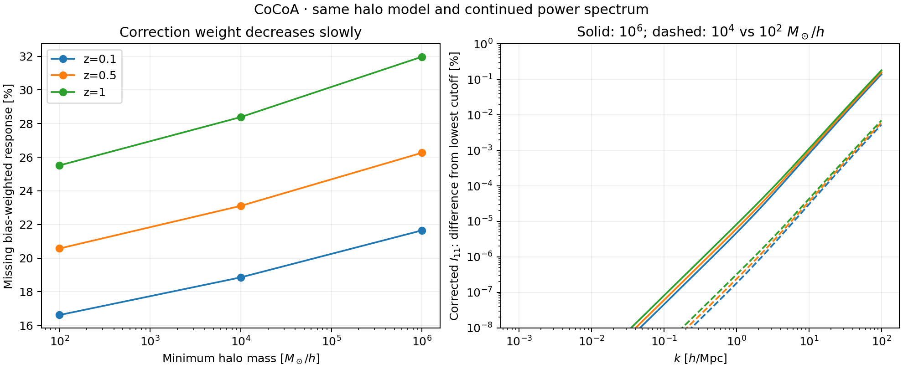

### Do the corrected predictions become more stable?

Yes, across the tested cutoffs. We evaluate three redshifts, 41
wavenumbers from 0.001 to 100 h/Mpc and all 861 unordered pairs, including
diagonal and unequal pairs. The angular tree averages are held fixed.
The table gives maximum absolute fractional changes, expressed in percent,
relative to the lower-cutoff result. For a trispectrum pair, both
wavenumbers must lie in the stated range.

| Quantity | 10⁶ versus 10², k ≤ 10 h/Mpc | 10⁴ versus 10², k ≤ 10 h/Mpc | 10⁶ versus 10², k ≤ 100 h/Mpc | 10⁴ versus 10², k ≤ 100 h/Mpc |
| --- | ---: | ---: | ---: | ---: |
| Corrected I11 | 0.00111% | 0.00004296% | 0.1795% | 0.006987% |
| Matter-power response entering SSC | 0.00000452% | 0.000000253% | 0.001384% | 0.00009550% |
| Sum of matter trispectrum terms | 0.00122% | 0.00004749% | 0.2866% | 0.01116% |
| Four-halo trispectrum term alone | 0.00442% | 0.0001718% | 0.7161% | 0.02794% |

The last extension, from 10⁴ to 10², moves I11 and the summed trispectrum
about 25 times less than the first extension, from 10⁶ to 10⁴. The
one-halo trispectrum is unchanged to roundoff in this test. Its higher
powers of halo mass strongly suppress the contribution of tiny halos.
All five separate trispectrum contributions and halo moments are retained
in the [result record](../results/mass_cutoff_20261006.json).

The corrected zero-wavenumber moment equals one to floating-point
precision at **every** cutoff. Extending the mass range therefore does
not repair a failed large-scale limit: it improves the explicit treatment
of the population represented by the finite-wavenumber correction.

The large correction weight and small prediction changes are consistent.
For wavelengths much larger than a small halo, its profile is nearly one
regardless of its exact mass. Moving that response from the completion
term into explicit small halos then changes very little. At larger k,
the profile shapes become distinguishable and the cutoff matters more.

### Numerical checks and the power-spectrum limitation

Increasing the mass rule from 256 to 512 nodes changes the tested moments
and trispectrum terms by at most **0.0000316%**. Raising internal table
boost from 4 to 8 changes them by at most **0.000946%**. These table errors
largely cancel when two cutoffs use the same tables: the measured cutoff
contrasts change by less than **0.000000181 percentage points** under
both refinements. The especially small SSC-response changes are therefore
resolved cutoff differences, not claims of equally small absolute errors.

As a separate check, keeping the original cutoff while changing only the
sigma-table domain moves the tested ingredients by at most **0.00123%**.
This is why the main cutoff comparison uses one common expanded table.

The supplied power table ends near **143 h/Mpc**. CoCoA continues it
using its existing edge power law. The fraction of the computed mass
variance coming from wavenumbers above that endpoint is approximately:

| Halo mass [solar masses/h] | Variance supplied by the high-k continuation |
| ---: | ---: |
| 10⁶ | 5.44% |
| 10⁴ | 40.52% |
| 10² | 65.07% |

Using OneCov's native hmf top-hat filter on this **same continued power**,
extending the integration endpoint from 10⁵ to 10⁷ h/Mpc changes sigma
by at most **0.00000348%**. The filter and CoCoA's FFTLog table agree
within **0.000193%** at these masses and redshifts. Thus the numerical
integration tail is small, but the extrapolated part of the input is not.
Integrating the extrapolation accurately does not establish its physical
accuracy or calibrate the halo fits at such low masses.

**Conclusion:** the extension achieves its intended purpose: more halo
response is integrated explicitly and less is assigned to the correction.
The corrected ingredients also stabilize strongly across the tested
cutoffs. This supports the existing completion on the tested moderate-k
scales. The full covariance test below follows these changes through
survey projection; neither test establishes an exact infinite-range
answer or calibrates the extrapolated small-halo model.

### What changes in the complete LSST Y1 covariance?

We also generate the **complete 1560 × 1560 real-space matrices**, with
Gaussian, SSC and connected non-Gaussian components saved separately.
Every matrix entry is compared, including cross-probe blocks; no
likelihood mask or eigenvalue repair is applied.

These runs use the LSST Y1 example's production interface and default
accuracy settings, including its Gaussian non-Limber spectra. The
integration level is zero (96-point GSL rules), and the internal table
boost is one. Only the halo mass panels change. All three cutoffs share
the same expanded sigma table, cosmology and byte-identical CAMB inputs.
The high-accuracy ingredient checks above are a separate calculation.

To avoid dividing by nearly zero cross-covariance entries, define the
entry difference relative to the reference **total** variances:

$$
E^X_{ij}=\frac{C^X_{ij}(M_{\min})-C^X_{ij}(10^2)}
{\sqrt{C^{\rm total}_{ii}(10^2)C^{\rm total}_{jj}(10^2)}}.
$$

Here X selects G, SSC, cNG or their total. The reference cutoff is a
comparison point, not an exact solution. The table reports the largest
absolute entry difference across each complete matrix, in percent.

| Component | 10⁶ versus 10² | 10⁴ versus 10² |
| --- | ---: | ---: |
| Gaussian | Exactly equal | Exactly equal |
| SSC | 5.92 × 10⁻⁷% | 2.12 × 10⁻⁸% |
| Connected non-Gaussian | 2.06 × 10⁻⁶% | 7.88 × 10⁻⁸% |
| Total | 2.07 × 10⁻⁶% | 7.92 × 10⁻⁸% |

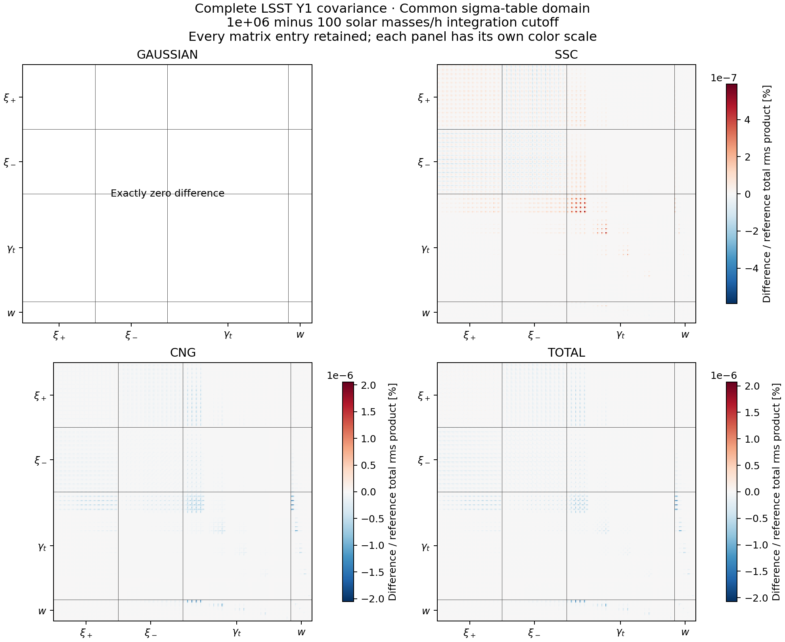

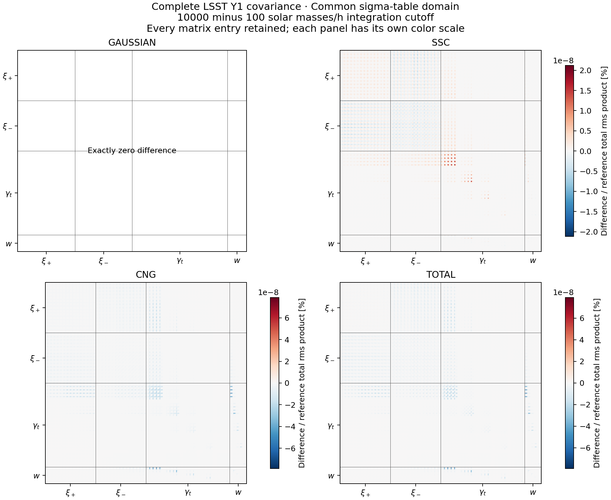

Each panel has its own color scale so the small residual structure is
visible. The Gaussian covariance is bitwise unchanged: this cutoff enters
the halo quantities used by SSC and cNG, while their Gaussian spectra
and noise are held fixed.

We also test **every variance mode**, solving the generalized eigenvalue
problem for the total matrices. Its extreme eigenvalues bound the variance
ratio for any linear combination of the 1560 observables. The maximum
fractional change is **4.56 × 10⁻⁸** for 10⁶ versus 10², and
**1.80 × 10⁻⁹** for 10⁴ versus 10². All totals are positive definite.

Separately, the largest generalized SSC change relative to the reference
total is 2.54 × 10⁻⁸; the cNG value is 4.37 × 10⁻⁸ for 10⁶ versus 10².
The small total difference therefore does not hide large, cancelling
component differences. The larger ingredient percentages at high k do
not translate directly into survey errors: projection weights and the
relative sizes of the halo terms determine their contribution.

There is a distinct **sigma-table regridding effect**. At the unchanged
10⁶ integration cutoff, switching from the original table domain to the
expanded one changes total variance modes by at most **0.000596%**.
Changing both the domain and integration cutoff from the installed
configuration to the 10² case gives **0.000596%** as well. This larger,
still small effect must not be attributed to the lower integration limit.
The [domain comparison plot](../results/figures/cutoff_full_domain.png) shows
its separate G, SSC, cNG and total matrices.

The full [10⁶-versus-10² record](../results/cutoff_full_6_vs_2_20261006.json),
[10⁴-versus-10² record](../results/cutoff_full_4_vs_2_20261006.json),
[first-step record](../results/cutoff_full_6_vs_4_20261006.json),
[domain control](../results/cutoff_full_domain_20261006.json) and
[combined-change record](../results/cutoff_full_native_vs_2_20261006.json)
retain component norms, diagonal changes, generalized modes, settings
and input fingerprints.

**Is 10⁴ a useful compromise?** Yes, as a way to reduce reliance on the
completion at modest cost for this configuration. At z = 1 it reduces
the missing response from 31.97% to 28.38%; extending to 10² changes the
complete covariance very little further. However, the test also shows
that the existing 10⁶ cutoff already has negligible covariance sensitivity
to this extension. A smaller correction is not proof of a more accurate
physical covariance.

This comparison isolates the cutoff at one cosmology and fixed numerical
settings. It does not establish convergence of other accuracy controls,
Fisher forecasts, or other surveys. The common sigma-table domain reaches
10² in all three diagnostic runs; the production change to a 10⁴ table
domain is checked separately below.

### Adopting the 10⁴ lower limit

The earlier halo comparison tables retain their original 10⁶ CoCoA
mass range. The new-default results are recorded separately here.

CoCoA's shared halo mass range now starts at **10⁴ solar masses/h**.
All seven project covariance examples use this limit. Two new one-decade
integration panels are added below 10⁶; the original eight panels above
10⁶ retain their boundaries and quadrature nodes.

- **Changed:** more low-mass halos contribute explicitly, reducing the
  response assigned to the unresolved population.
- **Retained:** the fitted halo bias, multiplicity normalization,
  concentration relation and minimum-mass-profile completion of I11.
- **OneCov:** its implementation and native model choices are unchanged.

The production sigma table now begins at 10⁴ too, whereas the controlled
cutoff scan used a common table beginning at 10². Comparing the resulting
full matrices separately distinguishes this table change from the mass
integration effect above.

The actual new production run gives the following maximum absolute entry
changes, normalized by each reference's total-variance product as above.
Both comparisons retain all **1560 × 1560** entries.

| Component | Versus original production (10⁶) | Versus wide-table control (10⁴) |
| --- | ---: | ---: |
| Gaussian | Exactly equal | Exactly equal |
| SSC | 1.89 × 10⁻⁵% | 8.65 × 10⁻⁶% |
| Connected non-Gaussian | 1.61 × 10⁻⁴% | 1.79 × 10⁻⁴% |
| Total | 1.59 × 10⁻⁴% | 1.80 × 10⁻⁴% |

The new total is **positive definite**. Its largest variance-mode change
is **0.000313%** relative to the original production matrix, and
**0.000309%** relative to the wide-table control at the same 10⁴ cutoff.
Comparison with the wide-table 10² result also gives **0.000309%**.
The remaining difference is dominated by sigma-table regridding, rather
than the extra low-mass integral.

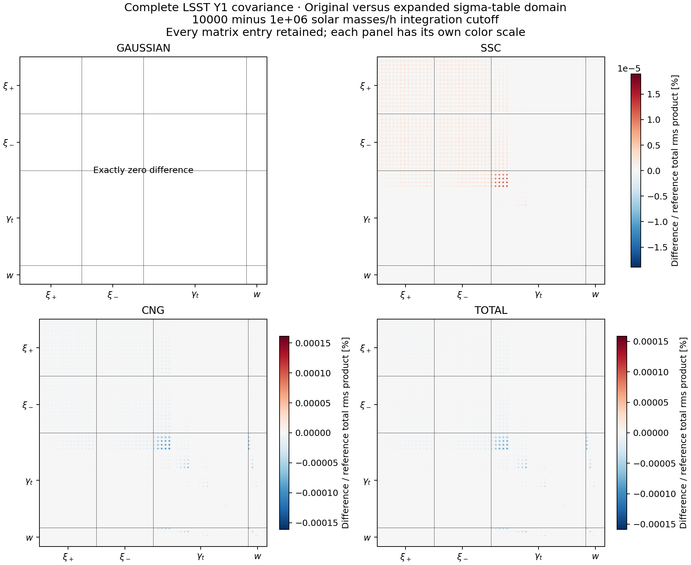

The [original-production comparison](../results/cutoff_production4_vs_native6_20261006.json),
[same-cutoff table comparison](../results/cutoff_production4_vs_wide4_20261006.json)
and [10² comparison](../results/cutoff_production4_vs_wide2_20261006.json)
record the separate component and total diagnostics, resolved settings and
source fingerprints. These checks support adopting the range extension;
they do not change the physical-calibration limits discussed above.
Separate full difference plots show the
[same-cutoff table comparison](../results/figures/cutoff_production4_vs_wide4.png)
and the [10² comparison](../results/figures/cutoff_production4_vs_wide2.png).

### Extending the diagnostic to 10⁻³ solar masses/h

**The code can integrate this lower range.** With the existing log-log
power extrapolation, lowering the minimum mass from 10⁴ to 10⁻³ reduces
the completion weight further. It makes a negligible difference to the
complete LSST Y1 covariance in this test. Production remains at 10⁴.

The comparison keeps the fitted multiplicity, halo bias, concentration
and additive I11 prescription unchanged. Seven new one-decade panels
extend the mass integral downward; all ten retained panels keep their
original nodes. Both cutoffs use the same expanded sigma table.

| Minimum mass [solar masses/h] | Missing response at z = 0.1 | At z = 0.5 | At z = 1 |
| ---: | ---: | ---: | ---: |
| 10⁴ | 18.8546% | 23.1060% | 28.3848% |
| 10² | 16.6180% | 20.5728% | 25.5131% |
| 1 | 14.7412% | 18.4360% | 23.0866% |
| 10⁻³ | 12.3943% | 15.7404% | 20.0074% |

At z = 1, seven additional mass decades reduce the missing response by
8.38 percentage points, about 29.5% of its previous value. The response
still converges slowly: the minimum peak height falls from 0.256 to
0.104, leaving a substantial part of the fitted low-peak-height population
outside the integral. This behavior is consistent with the slow
convergence discussed in [Mead et al., Appendix A](https://arxiv.org/html/2005.00009v2#A1).

The ordinary resolved mass fraction at this redshift rises from 60.53%
to 74.65%. That is a different quantity from the bias-weighted response.
In the figure, **1 − F** is the deficit relative to unit total mass;
it is not the integral of the fitted mass function below the cutoff.
The full extrapolated fit still has mass integral 1.04832 at z = 1.
Lowering the cutoff does not change that separate normalization choice.

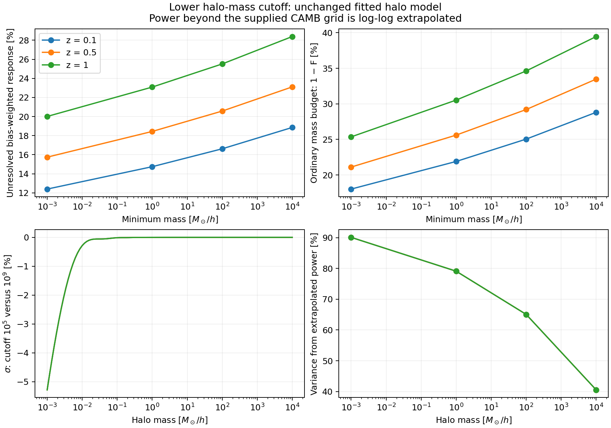

#### Why the power-integration endpoint must also change

CoCoA already extrapolates linearly in log P versus log k, equivalent to
continuing the last measured power-law slope. Requesting a smaller halo
therefore does not require a new power reader. It does require the
variance integral to cover the smaller halo's characteristic length.

For a mass of 10⁻³ solar masses/h, the smoothing radius is
1.42 × 10⁻⁵ Mpc/h, so its inverse is about 70,400 h/Mpc. The usual
10⁵ h/Mpc integration endpoint is too close to that scale. In the
isolated FFTLog calculation it underestimates sigma by about **5.3%**
relative to the extended calculation. Raising the endpoint from 10⁷ to
10⁹ h/Mpc changes sigma by less than **1.91 × 10⁻⁹ fractionally** over
the sampled mass grid. Both runs use exactly the same continued power.

OneCov's native hmf top-hat filter, supplied with this same continued
spectrum, agrees with the refined CoCoA sigma values at the four cutoff
masses within **0.000192%**. This checks two existing integration engines;
it does not establish the physical accuracy of the extrapolation.

| Halo mass [solar masses/h] | Variance from power above the supplied 143 h/Mpc endpoint |
| ---: | ---: |
| 10⁴ | 40.52% |
| 10² | 65.07% |
| 1 | 79.13% |
| 10⁻³ | 90.14% |

Thus there is no computational prohibition on using 10⁻³, but most of
its variance comes from extrapolated input. The halo fits are also being
extended far below their calibration range. A physical microhalo model
would need a specified small-scale dark-matter spectrum, including any
free-streaming cutoff; see [Schneider, Smith & Reed (2013)](https://arxiv.org/abs/1303.0839).

#### Does the wider mass range require excessive quadrature?

No such requirement appears in this test. The scan includes **96, 128,
256 and 512 nodes per panel**, corresponding to integration levels 0–3.
The table shows the largest change across I11, the five halo moments,
the separate trispectrum terms and the SSC response, relative to 512
nodes. It covers all four cutoffs, three redshifts and all pairs from
the 41-point grid between 0.001 and 100 h/Mpc.

| Nodes per panel | Largest ingredient change versus 512 nodes |
| ---: | ---: |
| 96 | 0.00383% |
| 128 | 0.000540% |
| 256 | 0.0000270% |
| 512 | Reference |

**The finer settings are checks, not proposed production requirements.**
The 96-node discrepancy is already small. Raising the separate internal
table boost from 4 to 8 changes the tested ingredients by at most
0.000946%. The measured 10⁴-versus-10⁻³ cutoff contrast itself is stable
within 9.33 × 10⁻¹¹ fractionally under that table refinement.

#### Complete covariance and runtime

The full 1,560 × 1,560 LSST Y1 matrices retain every entry. Their
Gaussian spectra include the example's non-Limber treatment; SSC and
cNG retain their existing prescriptions. These runs use the production
accuracy settings, including **96 mass nodes per panel**.

As in the earlier figures, each difference is divided by the reference
total covariance's diagonal rms product. Here the reference is the
10⁴ cutoff on the same expanded tables.

| Component | Largest normalized entry change [%] | Largest change in a total-variance mode [%] |
| --- | ---: | ---: |
| Gaussian | Exactly zero | Exactly zero |
| SSC | 2.21 × 10⁻⁸ | 1.21 × 10⁻⁷ |
| cNG | 8.21 × 10⁻⁸ | 1.72 × 10⁻⁷ |
| Total | 8.25 × 10⁻⁸ | 1.87 × 10⁻⁷ |


Both total matrices are positive definite. Their generalized variance
ratios range from 0.999999998507 to 1.000000001869. The much smaller
halos mostly replace a completion profile that was already nearly unity
on the relevant scales. A large decrease in correction weight therefore
need not produce a large change in the covariance.

A separate control keeps the integration cutoff at 10⁴ while expanding
the sigma-table mass and wavenumber ranges. Its maximum total-mode change
is **0.00177%**. That larger, but still small, table effect must not be
attributed to the newly integrated halos.

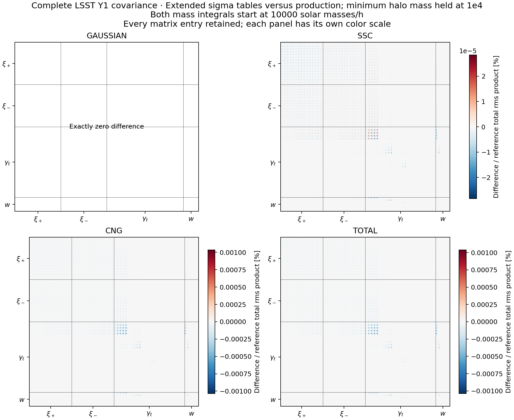

| Configuration | Mass nodes | Complete covariance construction [s] |
| --- | ---: | ---: |
| Production tables, minimum mass 10⁴ | 960 | 52.13 |
| Expanded tables, minimum mass 10⁴ | 960 | 51.91 |
| Same expanded tables, minimum mass 10⁻³ | 1,632 | 52.36 |

These are single sequential runs with eight OpenMP threads on the M2 Pro,
including first-use tables and all covariance components. CAMB setup and
file writing are excluded. Background application activity prevents a
precise slowdown claim from these measurements.

The [ingredient record](../results/microhalo_20261006.json),
[shared-power filter check](../results/microhalo_power_20261006.json),
[full cutoff comparison](../results/microhalo_full_cutoff_20261006.json) and
[fixed-cutoff table control](../results/microhalo_full_domain_20261006.json)
retain the settings, hashes and separate component diagnostics.

**Conclusion:** extending the integral reduces the completion weight,
but this test supplies no practical covariance-accuracy reason to replace
the production 10⁴ cutoff with 10⁻³. The numerical tail can be integrated
accurately; the small-halo modeling assumptions remain a separate issue.

### A cheap split integral down to 10⁻²⁰

**A 32-node low-mass tail works well in this diagnostic.** The ordinary
integral above 10⁴ keeps its ten panels and 96 nodes per panel. A second
integral covers 10⁻²⁰ to 10⁴ with only **32 nodes total**. Its halo weights,
profiles and additive completion use the same native C calculations.
The completion is applied once, after summing both pieces.

The comparison uses an isolated build. The production minimum of 64
quadrature nodes and production mass cutoff of 10⁴ remain unchanged.

We compare three ways to integrate the added tail:

- **One interval:** 32 nodes across all 24 mass decades.
- **Successive intervals:** six four-decade intervals, 32 nodes each.
- **Finer check:** the same six intervals, 128 nodes each.

All three use the same extended sigma table and the same retained
upper-mass nodes. The single 32-node tail and the finer check differ
by less than **3 × 10⁻¹² fractionally** across the tested corrected
moments, trispectrum terms and SSC response. This is a comparison at
fixed tables, not a claim of that absolute physical accuracy.

At z = 1 the unresolved response falls from 28.38% at the 10⁴ cutoff
to **9.21%** at 10⁻²⁰. The ordinary resolved mass fraction rises to
**92.02%**. Neither fact changes the multiplicity normalization of the
full fitted model.

#### Why so few low-mass nodes can work

Write the bias-weighted halo integration measure as
$`dw=(dn/dM)b(M)(M/\bar\rho_m)dM`$. For very small halos,
$`u(k|M)`$ is almost one on the scales being evaluated. The completed
moment can then be written approximately as

$$
I_{11}(k)\simeq\int dw\,u(k|M)+1-\int dw
=1+\int dw\,[u(k|M)-1].
$$

The raw integral of the response converges slowly. But in the last
expression its low-mass integrand is multiplied by a profile difference
that is nearly zero. The explicit integral and the completion cancel
most of the sensitivity to those tiny halos, including much of the
low-mass quadrature error. Higher moments also contain additional powers
of halo mass, which suppress the small-halo contribution.

The actual implementation retains the minimum-mass profile instead of
replacing it by one. The equation explains the limiting behavior; it is
not a new implementation or a change to the halo prescription.

#### Complete matrices and execution time

Every entry of the 1,560 × 1,560 G, SSC, cNG and total matrices is
compared. The 32-node tail and finer tail give Gaussian matrices that
are bitwise equal. Their SSC, cNG and total entry differences are all
below **4 × 10⁻¹³ of the reference total rms product**. Generalized
total-mode differences are below 7 × 10⁻¹², at the numerical precision
of this matrix comparison. Both totals are positive definite.

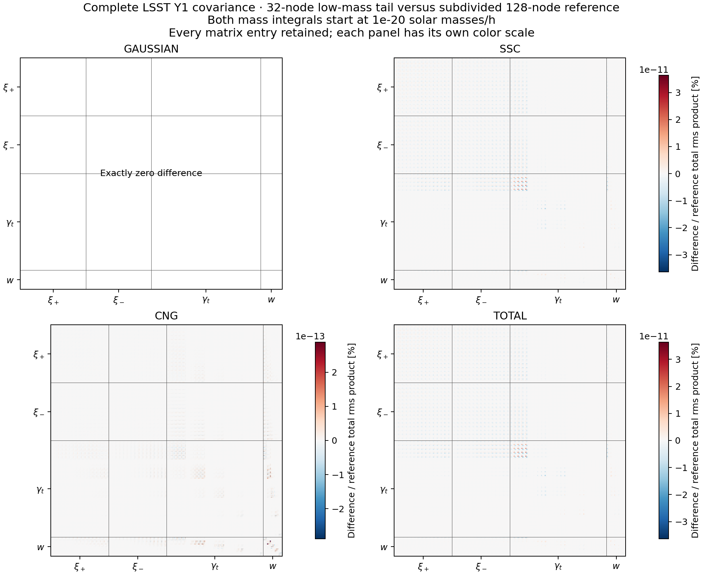

Extending the cutoff from 10⁴ to 10⁻²⁰ on common tables changes the
largest total variance mode by only **1.87 × 10⁻⁷%**, essentially the
same sensitivity already seen when extending to 10⁻³. Further reducing
the correction weight does not materially change this forecast.

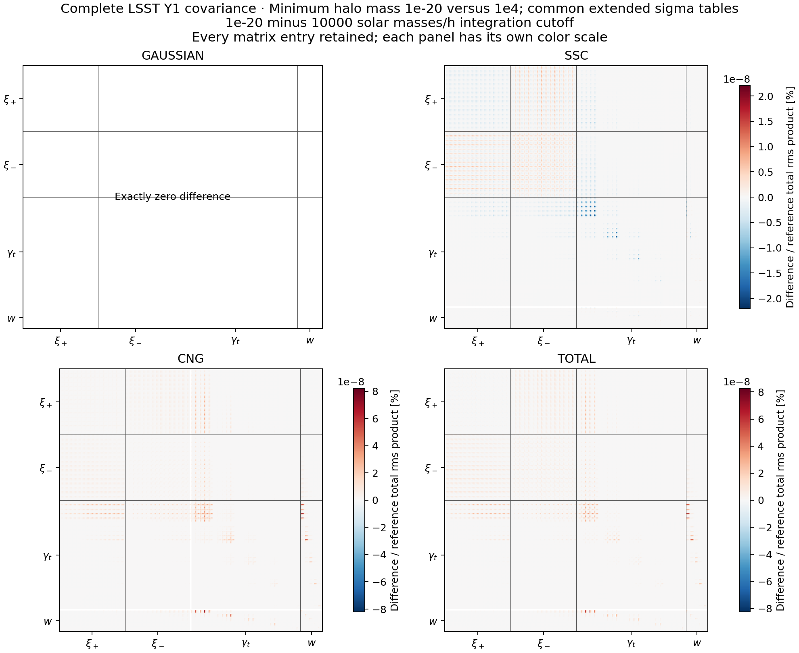

| Configuration on common extended tables | Total mass nodes | Complete construction [s] |
| --- | ---: | ---: |
| Stop at 10⁴ | 960 | 49.17 |
| Add one 32-node tail down to 10⁻²⁰ | 992 | 50.70 |
| Add six 128-node intervals down to 10⁻²⁰ | 1,728 | 50.41 |

These single sequential eight-thread measurements include first-use
tables and all components, excluding CAMB setup and file writing.
They show an affordable calculation; their scatter does not establish
a speed advantage for one low-mass rule.

The expanded table domain itself changes total modes by **0.00831%** at
a fixed 10⁴ integration cutoff. The separate
[full domain-control figure](../results/figures/split_full_domain.png)
keeps that numerical table effect distinct from the added halo integral.

At 10⁻²⁰, **99.84% of sigma squared comes from extrapolated power**.
The power integration was extended to 10¹⁵ h/Mpc; OneCov's same-input
filter changes sigma by less than 1.11 × 10⁻¹⁰ when extending its endpoint
from 10¹³ to 10¹⁵. CoCoA's FFTLog/table result differs from that filter by
up to **0.116% at the smallest mass**, despite much closer agreement at
larger masses. This extreme-domain numerical limitation and the uncalibrated
small-halo physics remain distinct from the excellent agreement between
the two mass quadratures. No production adoption follows from this test.

### Extrapolating the partial sums

The proposed method is called **convergence acceleration**. We test
Aitken's delta-squared transformation and the iterated Shanks
transformation, evaluated with Wynn's epsilon algorithm. These methods
infer a limiting sum from how successive partial sums change. See
[Brezinski & Redivo-Zaglia](https://arxiv.org/abs/1402.2473) for the
relationship between Shanks transformations and epsilon algorithms.

The partial integrals stop at 10⁴, 1, 10⁻⁴, 10⁻⁸, 10⁻¹², 10⁻¹⁶ and
10⁻²⁰ solar masses/h. Every added four-decade interval uses 32 nodes,
preserving all earlier quadrature samples. For the zero-wavenumber
bias-weighted integral, the known full-fit limit is one.

| Lowest included mass [solar masses/h] | Raw partial response at z = 1 | Aitken estimate of the limit | Wynn estimate of the limit |
| ---: | ---: | ---: | ---: |
| 10⁻⁴ | 0.809046 | 0.930930 | 0.930930 |
| 10⁻¹² | 0.867548 | 0.991089 | 1.000481 |
| 10⁻²⁰ | 0.907929 | 1.002344 | 0.999010 |

**The acceleration helps the raw sum, but does not improve on the known
normalization already enforced by CoCoA.** Wynn's error at z = 1 drops
to 0.0481% with five partial sums, then grows to 0.0990% with seven.
Adding terms does not guarantee a better extrapolation.

As a prediction check, fitting a geometric remainder using only partial
sums through 10⁻¹² predicts the held-out 10⁻¹⁶ and 10⁻²⁰ integrals within
0.0242% and 0.0749%, respectively, across the three redshifts. Repeating
with finer low-mass quadrature and denser internal tables retains the
same broad behavior.

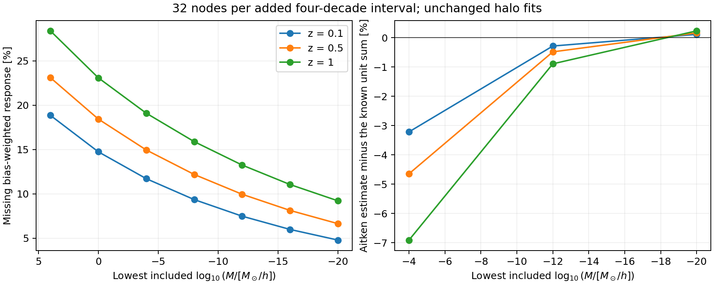

The finite-wavenumber test is more relevant to covariance. We remove the
native completion from the saved I11 moments, extrapolate these resolved
partial integrals, and compare with the finely integrated, completed I11.
With all seven partial sums, the largest discrepancies over the tested
redshifts and 0.001–100 h/Mpc range are **0.519% for Aitken** and
**0.216% for Wynn**. Keeping the existing completion at the ordinary
10⁴ cutoff instead changes I11 by only **0.00729%** against the same
deep-cutoff reference.

The extrapolation arithmetic took **0.029 seconds** for this initial
batch of estimates; it is not the expensive part. With these settings
the extrapolation was less accurate than the existing completed moment.
The deeper study below tests whether better numerical conditioning and
more partial sums produce a useful stopping point. The full-matrix
figures above validate the cheap split quadrature, not an extrapolated
covariance model.

The [split-tail and series record](../results/split_tail_20261006.json),
[shared-power check](../results/split_tail_power_20261006.json),
[full quadrature comparison](../results/split_full_rule_20261006.json),
[full cutoff comparison](../results/split_full_extension_20261006.json) and
[table-domain control](../results/split_full_domain_20261006.json)
preserve the settings and separate component diagnostics.

### Finding a reliable cutoff for the accelerated sum

**The deeper sequence improves the extrapolation substantially.** The
aim is to find how soon integration can stop while the inferred remainder
is accurate and stable under refinement. The test keeps 32 nodes per
four-decade low-mass interval and continues through 10⁻⁴⁸ solar masses/h.
The final two decades to 10⁻⁵⁰ are held out of the equal-step sequence.

#### What changed in FFTLog, and why

The first extreme-mass test exposed a numerical problem in sigma, so the
private diagnostic build changes the **FFTLog weighting exponent from
1.5 to 0.5**. This exponent is often called the FFTLog bias. It is
unrelated to the physical halo bias b(M).

Start with the physical variance:

$$
\sigma^2(R)=\int d\ln k\,\Delta^2(k)W^2(kR),
\qquad \Delta^2(k)=\frac{k^3P(k)}{2\pi^2}.
$$

FFTLog first divides the input by a chosen power of k:

$$
g(\ln k)=k^{-b}\Delta^2(k).
$$

It expands g into Fourier modes in ln k. Restoring the divided-out power
turns each mode into k raised to b + iη. The integral of that mode against
the spherical top-hat window is known analytically; its radius dependence
is R raised to −b − iη. The inverse transform adds those integrated modes
to recover sigma squared.

Thus **the power law is removed before the transform and restored in its
analytic kernel**. Changing b does not change the continuous physical
integral. It changes the numbers represented on the finite FFT grid and
how its periodic approximation behaves. At extremely small R, the R⁻ᵇ
reconstruction factor also makes the weighting relevant to numerical
conditioning. See [Hamilton's FFTLog description](https://jila.colorado.edu/~ajsh/FFTLog/)
for the distinction between the continuous and discrete transforms.

A controlled test holds the mass domain, power spectrum, k cutoff,
quadrature and table resolution fixed, changing only this exponent.
At 10⁻²⁰ solar masses/h, the largest sigma difference from OneCov's
filter on the **same power** falls from **0.116% to 0.000173%** over
z = 0.1, 0.5 and 1. This establishes the improvement without attributing
it solely to floating-point roundoff rather than other finite-FFT errors.

For the deeper sequence, the private table extends to 10⁻⁵⁰ and the power
integral to 10²⁵ h/Mpc. At that minimum mass, sigma agrees with the
same-input filter within **0.000237%**. Extending the filter endpoint
from 10²³ to 10²⁵ changes sigma by less than 1.11 × 10⁻¹⁰ fractionally.
The continued power and halo fits are the same extrapolated model as
before. Production retains its original FFTLog weighting and mass domain.

#### How much missing response remains?

At zero wavenumber the bias-weighted full-fit integral B is one. The
completion weight for a directly integrated partial sum is 1 − B_partial.
After acceleration, 1 − B_estimate measures the residual that would remain
if the inferred tail replaced that missing contribution.

| Cutoff [solar masses/h] | Direct B at z = 1 | Wynn limit estimate | Residual magnitude [% of unit response] |
| ---: | ---: | ---: | ---: |
| 10⁻²⁰ | 0.907887 | 1.001992 | 0.1992 |
| 10⁻³² | 0.946787 | 0.999808 | 0.01924 |
| 10⁻⁴⁰ | 0.963215 | 0.999970 | 0.00301 |
| 10⁻⁴⁸ | 0.974640 | 0.999996 | 0.000385 |

These Wynn estimates use the highest available order with an odd number
of consecutive partial sums, always including the newest integral.
At 10⁻⁴⁸, refining the lower intervals to 128 nodes and doubling the
internal table boost changes the estimate from **0.99999615 to
0.99999636**. The much larger raw missing response has been recovered
numerically rather than simply assigned by the unit-normalization rule.

The finite-k test removes the existing completion before accelerating
I11. It then compares the result with the refined, completed native I11
over all three redshifts and 41 wavenumbers from 0.001 to 100 h/Mpc.

| Cutoff | Largest I11 error, 32-node tail [%] | Refined tail and tables [%] |
| ---: | ---: | ---: |
| 10⁻³² | 0.04260 | 0.04259 |
| 10⁻³⁶ | 0.01269 | 0.01265 |
| 10⁻⁴⁰ | 0.00668 | 0.00665 |
| 10⁻⁴⁴ | 0.00308 | 0.00307 |
| 10⁻⁴⁸ | 0.000858 | 0.000776 |

**For a 0.01% ingredient target, 10⁻⁴⁰ is the shallowest tested cutoff
that passes with this sequence and extrapolation order.** For 0.1%,
10⁻³² suffices; a 0.001% target first passes at 10⁻⁴⁸. These are measured
stopping points for the tested model, not universal covariance tolerances.
The completed native moment is the reference here, not an independent
exact finite-k integral.

Numerical stability still needs attention. Wynn applied to only the last
seven partial sums encounters an unstable estimate near the 10⁻²⁸
cutoff: its bias-sum error reaches about 5%. That behavior survives
quadrature refinement. It improves again at deeper cutoffs, reaching
0.00652% maximum finite-k error at 10⁻⁴⁸. Increasing order or extending
the range alone is therefore not a sufficient convergence check.

A separate prediction test fits the last three partial sums through
10⁻⁴⁸ and predicts the held-out integral at 10⁻⁵⁰ within **0.000114%**
across the three redshifts. All the bias, mass and finite-k extrapolation
calculations in this report take about **0.44 seconds**; this excludes
generating their input integrals.

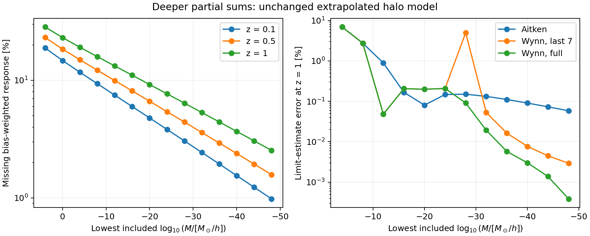

#### Does this repair the ordinary mass normalization?

**No: it recovers the fitted model's limit more accurately.** Ordinary
mass weighting and bias-weighted response are distinct integrals:

- **Bias-weighted response:** the fitted normalization imposes
  the full integral of b(ν)f(ν) equal to one. Acceleration recovers this
  limit without having to integrate the entire low-mass tail explicitly.
- **Ordinary mass fraction:** the full integral of f(ν) is approximately
  1.00649, 1.02622 and 1.04832 at z = 0.1, 0.5 and 1. The acceleration
  does not change that fitted normalization.

At z = 1, the directly resolved mass integral is 0.920175 at 10⁻²⁰,
1.001026 at 10⁻⁴⁰ and 1.019583 at 10⁻⁵⁰. Its passage near one is
accidental: the upper-limit estimate from the partial sums is **1.0483204**,
in agreement with the analytic integral **1.0483203** of the retained
fit. The approximately **4.83% mass-normalization excess remains**.
Reducing a missing-tail error cannot remove a normalization mismatch
already present in the full fitted model.

#### Full covariance check and execution time

We also compare every entry of complete 1,560 × 1,560 LSST Y1 matrices,
lowering the cutoff from 10⁻²⁰ to 10⁻⁵⁰ on common expanded tables.
Both calculations retain the existing additive completion.

| Component | Largest entry change / reference total rms product |
| --- | ---: |
| Gaussian | Exactly zero |
| SSC | 1.10 × 10⁻¹⁴ |
| cNG | 5.44 × 10⁻¹⁴ |
| Total | 5.45 × 10⁻¹⁴ |

Both totals are positive definite. Generalized total-variance ratios
differ from one by at most 2.61 × 10⁻¹², near the precision of this
comparison. This confirms the cutoff's negligible effect on the already
completed forecast; it does not validate an accelerated replacement.

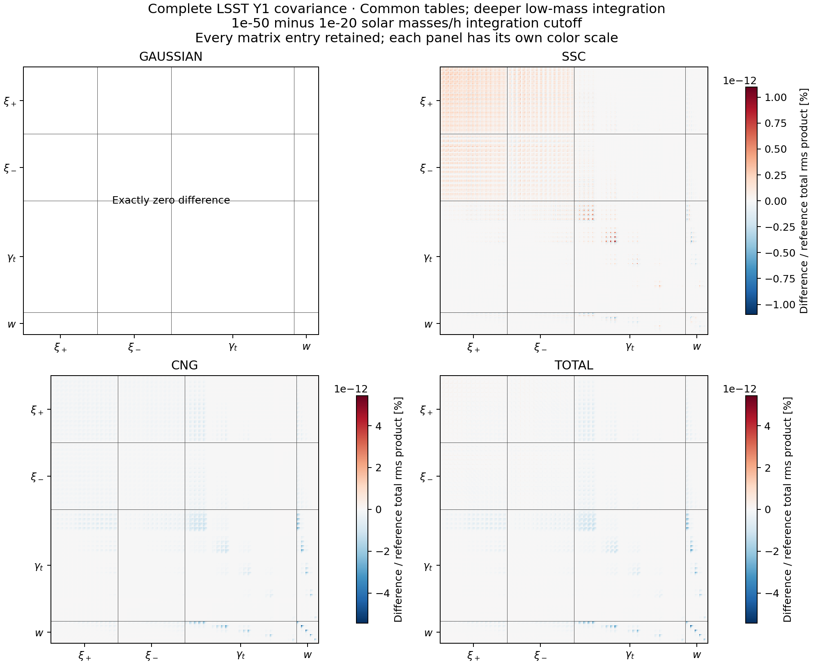

| Minimum mass [solar masses/h] | Complete covariance construction [s] |
| ---: | ---: |
| 10⁻²⁰ | 50.30 |
| 10⁻⁵⁰ | 51.30 |

These are single sequential runs with eight OpenMP threads on the M2 Pro.
The scope includes first-use tables and G, SSC and cNG assembly, excluding
CAMB setup and file writing. The observed extra second is about 2%; these
single runs do not establish a precise performance ratio.

The [series and mass-integral record](../results/deep_series_20261006.json),
[controlled FFTLog comparison](../results/fftlog_bias_20261006.json),
[deep shared-power check](../results/deep_series_power_20261006.json) and
[full component comparison](../results/deep_full_extension_20261006.json)
contain the measured values and input provenance. No production code,
normalization prescription or covariance completion has been changed.

#### Reproducing the split and partial integrals

Use the Cocoa environment described above. These commands create an
isolated diagnostic build; the installed library remains unchanged.

**Step :one:** build the extended table domain and separate low-mass rule.

```bash
python scripts/build_mass_cutoff.py --log10-min -20 \
  --sigma-log10-kmax 15 --split-tail --output work/split_tail_build
```

**Step :two:** test a single 32-node tail with ordinary upper-mass quadrature.

```bash
python scripts/diagnose_mass_cutoff.py --interface work/split_tail_build \
  --exponents 4 -20 --boost 4 --nodes 96 --repeats 3 \
  --tail-nodes 32 --tail-panels single --tail-log10-max 15 \
  --output work/split_single32
```

**Step :three:** save the successive partial integrals.

```bash
python scripts/diagnose_mass_cutoff.py --interface work/split_tail_build \
  --exponents 4 0 -4 -8 -12 -16 -20 --boost 4 --nodes 96 --repeats 3 \
  --tail-nodes 32 --tail-panels intervals --tail-log10-max 15 \
  --output work/split_intervals32
```

The saved comparison repeats the tail with 128 nodes per interval and
then raises the table boost to 8. `report_split_tail.py` compares those
four runs and computes the partial-sum estimates. Full matrices use
`run_cutoff_covariance.py` with the same `--interface`, `--log10-min`,
`--tail-nodes` and `--tail-panels` choices.

#### Reproducing the deeper acceleration study

Use the Cocoa environment, one numerical process at a time.

**Step :one:** build the isolated, reweighted FFTLog calculation.

```bash
python scripts/build_mass_cutoff.py --log10-min -50 \
  --sigma-log10-kmax 25 --sigma-bias 0.5 --split-tail \
  --output work/deep_series_build
```

**Step :two:** save all the nested partial integrals.

```bash
python scripts/diagnose_mass_cutoff.py --interface work/deep_series_build \
  --exponents 4 0 -4 -8 -12 -16 -20 -24 -28 -32 -36 -40 -44 -48 -50 \
  --boost 4 --nodes 96 --repeats 3 --tail-nodes 32 \
  --tail-panels intervals --tail-log10-max 25 --output work/deep_series32
```

**Step :three:** refine the lower quadrature and internal tables.

```bash
python scripts/diagnose_mass_cutoff.py --interface work/deep_series_build \
  --exponents 4 0 -4 -8 -12 -16 -20 -24 -28 -32 -36 -40 -44 -48 -50 \
  --boost 8 --nodes 96 --repeats 3 --tail-nodes 128 \
  --tail-panels intervals --tail-log10-max 25 --output work/deep_series128
```

**Step :four:** record the full-fit mass normalization at the finer settings.

```bash
python scripts/diagnose_mass_cutoff.py --interface work/deep_series_build \
  --exponents 4 --boost 8 --nodes 96 --repeats 2 --tail-nodes 128 \
  --tail-panels intervals --tail-log10-max 25 --output work/deep_mass_limit
```

**Step :five:** compare the accelerators and make the scientific figure.

```bash
python scripts/report_deep_series.py --coarse work/deep_series32 \
  --fine work/deep_series128 --limits work/deep_mass_limit \
  --old work/mass_cutoff_native8 \
  --output work/deep_series_report.json --figure work/deep_series.png
```

The controlled exponent test uses the earlier 10⁻²⁰ build settings with
`--sigma-bias 0.5`, leaving its other controls fixed. The saved
`report_fftlog_bias.py` comparison checks equal power arrays and domains.
Full matrices use the same runner as above at `--log10-min -20` and
`--log10-min -50`, retaining `--tail-nodes 32 --tail-panels intervals`.

### Cost and reproduction of the 10⁶-to-10² scan

On the Apple M2 Pro with eight OpenMP threads, the following times cover
one call producing I11 and all five pair moments at all three redshifts.
They are means and sample standard deviations of 11 repeated calls at
512 nodes per panel. First-use tables, power generation, tree averages,
SSC response and survey projection are excluded; these are **ingredient
timings**, not full covariance runtimes.

| Minimum mass [solar masses/h] | Mass panels | Halo-moment time [ms] | Relative to original range |
| ---: | ---: | ---: | ---: |
| 10⁶ | 8 | 5.58 ± 0.55 | 1.00 |
| 10⁴ | 10 | 7.14 ± 0.82 | 1.28 |
| 10² | 12 | 9.17 ± 1.33 | 1.64 |

The measured halo-moment stage is therefore **28% slower** at 10⁴ and
**64% slower** at 10². The extra panels calculate the newly included
mass intervals. These percentages must not be applied directly to a
full covariance runtime, which includes other stages.

For the **complete LSST Y1 covariance**, three fresh processes per cutoff
give the following means and sample standard deviations. These timings
include first-use tables, spectra, halo calculations and matrix assembly.
CAMB initialization and file writing are outside this interval. Runs use
the production interface, eight OpenMP threads and the same expanded
sigma-table domain, at the default accuracy described above.

| Minimum mass [solar masses/h] | Full covariance time [s] | Mean relative to 10⁶ |
| ---: | ---: | ---: |
| 10⁶ | 49.57 ± 2.12 | 1.000 |
| 10⁴ | 50.88 ± 0.83 | 1.026 |
| 10² | 50.18 ± 1.69 | 1.012 |

The full-runtime cost is modest in these measurements. Its precise size
is not resolved by three runs: differences are comparable to the observed
scatter, and the 10² mean happens to fall below the 10⁴ mean. This does
not show that integrating more mass panels is faster. In particular,
the **64% ingredient slowdown is not a 64% full-covariance slowdown**.
All physical outputs repeat bitwise within each configuration. The
[timing record](../results/cutoff_full_timing_20261006.json) preserves every
stage, individual run and input hash.

With its actual 10⁴ sigma-table domain, the new production run took
**50.63 seconds** for the same full covariance. This is one run, with the
same timing boundaries; the repeated timings above isolate the integration
cutoff while holding the wider table domain fixed.

Reproduction uses an isolated diagnostic build with only the supported
halo-table lower boundary extended. The installed CoCoA interface and
its numerical source files are not edited. Activate the two environments
as described above and execute these numerical runs sequentially.

**Step :one:**: in the **Cocoa terminal**, prepare the wider table domain.

```bash
python scripts/build_mass_cutoff.py --output work/mass_cutoff_build
```

**Step :two:**: compare the cutoffs with the first accuracy settings.

```bash
python scripts/diagnose_mass_cutoff.py --interface work/mass_cutoff_build \
  --output work/mass_cutoff_boost4
```

**Step :three:**: refine the tables and mass quadrature.

```bash
python scripts/diagnose_mass_cutoff.py --interface work/mass_cutoff_build \
  --output work/mass_cutoff_boost8 --boost 8 --nodes 256 512
```

**Step :four:**: prepare the original 10⁶ table domain in a second isolated
build. This preserves the original control after CoCoA adopts 10⁴.

```bash
python scripts/build_mass_cutoff.py --output work/mass_cutoff_original \
  --log10-min 6
```

**Step :five:**: evaluate that original domain.

```bash
python scripts/diagnose_mass_cutoff.py --interface work/mass_cutoff_original \
  --output work/mass_cutoff_native8 \
  --boost 8 --nodes 256
```

**Step :six:**: in the **OneCov terminal**, check the shared-power tail.

```bash
python scripts/check_cutoff_power.py work/mass_cutoff_boost8 \
  --output work/mass_cutoff_power.json
```

**Step :seven:**: create a new summary and the scientific figure.

```bash
python scripts/report_mass_cutoff.py --fine work/mass_cutoff_boost8 \
  --coarse work/mass_cutoff_boost4 --native work/mass_cutoff_native8 \
  --power-check work/mass_cutoff_power.json \
  --output work/mass_cutoff_summary.json
```

To reproduce the complete matrices, continue in the **Cocoa terminal**.
These commands use the wider-domain build prepared in Step 1 above.

**Step :one:**: generate the 10⁶ integration-cutoff control.

```bash
python scripts/run_cutoff_covariance.py --interface work/mass_cutoff_build \
  --log10-min 6 --output work/cutoff_full_wide6
```

**Step :two:**: generate the 10⁴ matrix.

```bash
python scripts/run_cutoff_covariance.py --interface work/mass_cutoff_build \
  --log10-min 4 --output work/cutoff_full_wide4
```

**Step :three:**: generate the 10² comparison matrix.

```bash
python scripts/run_cutoff_covariance.py --interface work/mass_cutoff_build \
  --log10-min 2 --output work/cutoff_full_wide2
```

**Step :four:**: compare every entry and variance mode and draw the
four component-difference panels. Repeat with the 10⁶ folder to test the
full extension.

```bash
python scripts/compare_full_covariance.py work/cutoff_full_wide4 \
  work/cutoff_full_wide2 --output work/full_cutoff_comparison.json \
  --figure work/full_cutoff_comparison.png
```

**Step :five:**: for repeated timings, rerun Steps 1–3 sequentially in
fresh processes, using output suffixes `_repeat2` and `_repeat3`.
Summarize those nine runs and check that their physical outputs are
bitwise equal within each cutoff:

```bash
python scripts/report_cutoff_covariance.py \
  --output work/full_cutoff_timing.json
```

**Step :six:**: evaluate the adopted production setting, using the installed
CoCoA build with its 10⁴ table boundary.

```bash
python scripts/run_cutoff_covariance.py --log10-min 4 \
  --output work/cutoff_full_production4
```

**Step :seven:**: compare it with the wider-table control at the same cutoff.

```bash
python scripts/compare_full_covariance.py work/cutoff_full_production4 \
  work/cutoff_full_wide4 --output work/production4_vs_wide4.json \
  --figure work/production4_vs_wide4.png
```

